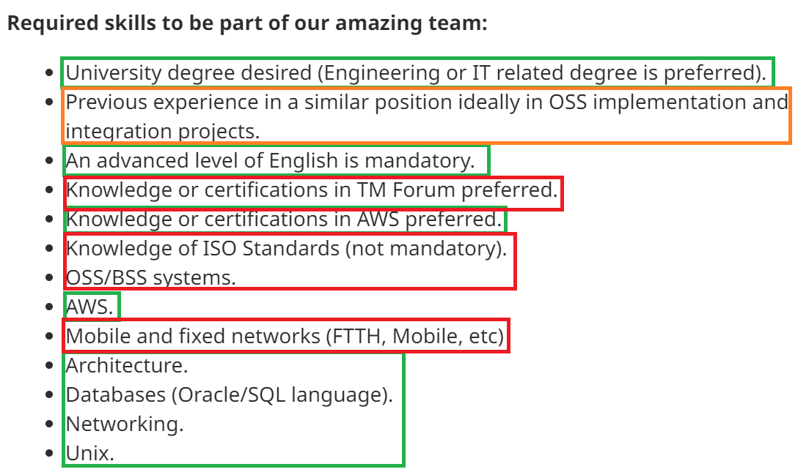
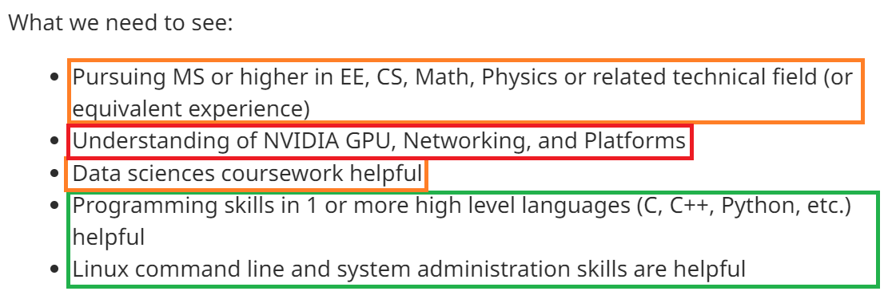
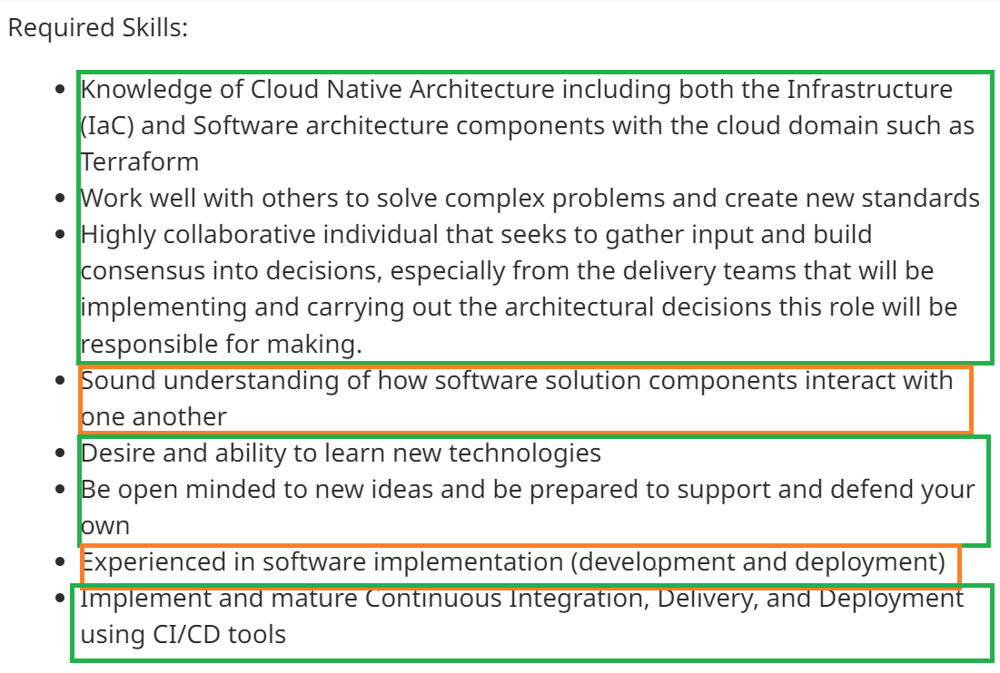
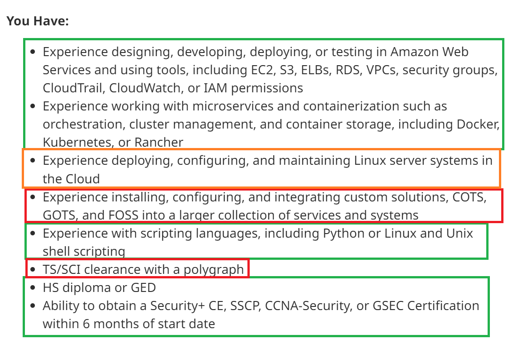
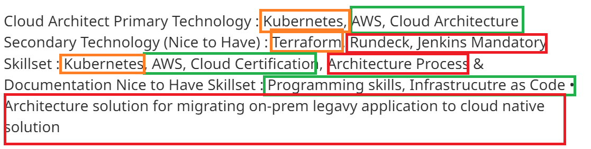
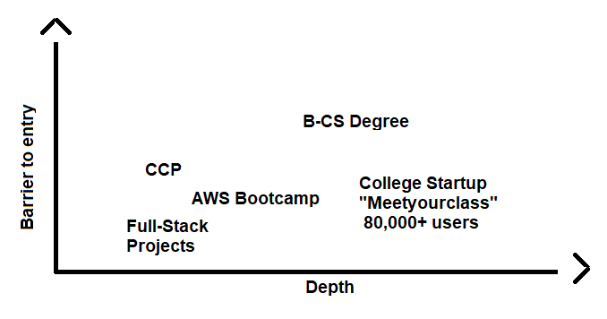

# Module 1 — Cloud Roles

- Cloud roles can be **inconsistent**
  - Depends on companies & regions
  - Rather use framework/approaches 

## Cloud Sins
- Badge collecting
  - There is not correlation
  - Certifications are only part of your resume 
  - Certifications are even named after roles. Do not let that lock you in.
- Spending time on your low priority list
- Beginner resume
- Following feedback blindly 
- Showcase and use your skills
- Following a roadmap blindly
  
## Q&A Section
- credibility (chance of getting a job) = barrier to entry + evidence depth
  - certifications = low barrier to entry, somewhat low evidence depth
  - open source = more barrier to entry, more evidence depth
  - pro experience = high barrier to entry, high evidence depth
- breaking the chicken-egg cycle
  - Identitfy the gap and try to close it
    - Gap = Difference between your current skills and the skills needed for the job
  - Do projects, freelance, team work
- **Golden rules**
    1. Are skills cohesive
    2. Align with your goals
    3. Is not a duplicate skills

## Roles
1. Support (less technical, good starting point)
2. Manager / Analyst (People oriented, business skills, communication heavy, client-facing S.A.)
3. **Engineer** (Highly technical, coding heavy, less communication)
4. **Architect** (High level design, business + tech, sales-environment, lots of interaction with stakeholders)

- Ask yourself these questions:
  - Are you visual?
  - Do you like data?
  - Do you like working with people?
  - ...

## Creating Roadmap
- Focus on **job descriptions** and not the job title

## Homework
- [x] Questions
  1. I am going to become a: Architect
  2. I am a good fit because: I enjoy the big picture things and connecting micro-services together to create useful tools. Overall I like the combination of technical and social aspects of the role.
  3. I will know:
     1. Content to get my solutions architect certification
     2. Communcations skills that are generally needed
     3. More AWS skills
  4. I will not get distracted by:
     1. Machine learning
     2. Learning Rust
     3. Web development
  
- [x] Analysing Job Postings (Green = YES, Orange = MAYBE, RED = No)
  1.   
  2.   
  3.   
  4.  
  5.  

# Module 2 — Cloud Resumes

## Thinking like a hiring manager
- Considerations:
  - Proficiency in the exact stack
  - Needs lots of teaching
  - Only certs and not practice

## Learning from resume examples
- Positives
  1. Carrer Summary
  2. Follow UX design content-hierarchy thinking
  3. Professional experience should be the core of your resume
  4. Evidence (ex. GitHub repo url)
  5. Mention not just concepts but also specific language, tech and frameworks
  6. Add tangible differences you made at your old positions
    - Good spot to mention stakeholders
  7. Putting projects and professional experience together
  8. Add "tech labels" to specific experiences
- Negatives
  1. Education, certs before work experience and projects
  2. Having an profile image
  3. Lots of white space & poor structure
  4. Simply having too much content and no "story" (done with interesting context)

## Q&A
- Q: How to grade your skill level?
  - A: Do not have such section
- Q: How to write about this AWS Bootcamp in our resume?
  - A: Mention extras
- Q: How to format a resume coming from IT?
  - A: Focus on cloud aspects
- Q: How to draw attention to your resume?
  - A: Reflect and get feedback
- Q: How many projects should I mention?
  - A: There is not magic number. Make sure they are role specific. 2-3 projects is generally a good range.

## Homework

- [x] Fears & Dreams of Hiring Mangers
  - Fears:
    - Imcompatible fit (can not see the person being able to integrate into the existing team)
    - Losing good talent
    - Skill shortage
  - Dreams:
    - Finding top talent
    - Building cohesive and diverse teams
    - Finding people with the potential to keep growing
    - Concrete example projects that match the company's mission
- [x] Restructure your resume
  - I do not have a resume yet
  - I currently have my AWS CCP cert and doing this AWS Bootcamp. I will present those experiences alongside some of the team/creative skills that I have gained from a part-time-job as a no-code "tech allrounder" & my future CS degree.
- [x] Credibility Matrix
  - 
- [x] Opportunities
  - I am planning on taking the solutions architect exam
  - Creating a cloud project with stakeholders or joining an open source cloud project 

# Module 3 — Job Search
# Module 4 — Interviewing

