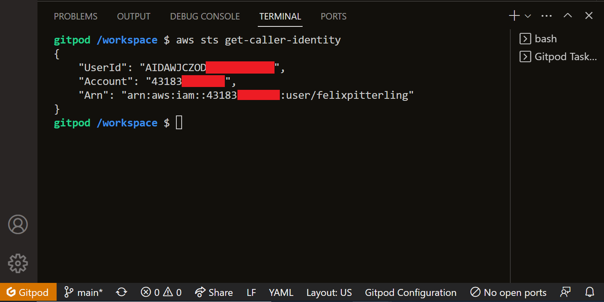

# Week 0 — Billing and Architecture

## Homework

- [x] Conceptual Diagram

 [Lucid Diagram Link](https://lucid.app/lucidchart/94ba19ca-dc63-4646-8aa5-59c6bd457592/edit?viewport_loc=-820%2C-442%2C3328%2C1598%2C0_0&invitationId=inv_cf5a0d28-eb97-4ab7-bf44-097bb0c41a65)

- [x] Logical Architectual Diagram

 [Lucid Diagram Link](https://lucid.app/lucidchart/779c8a31-bc89-4566-866e-d867c623207c/edit?viewport_loc=33%2C214%2C3138%2C1335%2C0_0&invitationId=inv_20c78894-3f2d-4032-95e8-e4eea91db021)
 
 

- [x] Create an Admin User
- [x] Use CloudShell

- [x] Generate AWS Credentials

 

- [x] Installed AWS CLI
 
 [Gitpod Yaml File](../.gitpod.yml)
 
 
 
 - [x] Create a Budget

 
[budget.json](../aws/json/budget.json),
[budget-notifications-with-subscribers.json](../aws/json/budget-notifications-with-subscribers.json)
 
  

- [x] Create a Billing Alarm

[alarm_config.json](../aws/json/week0-alarm_config.json)

## Homework Challenges 

## Class Notes

### _Random Notes_

> Soft Skills are important for interviews - Shala Warner

> The sustainability pillar is the underdog - Margaret Valtierra

- 4C Model vs TOGAF vs DOD Framework vs ...
  - All ask the same question: how to make something complicated → simple

### _1. Real-Life Scenario (with Margaret Valtierra)_

- Situation: Meeting with investors and & board
- Big-Idea: CRUD Social Media App
- User Target: Students & Busy Professionals
- Concepts:
  - Time-Limited Content
  - Authentication
  - **Microservice** architecture
    - Separate authentication, UI, business, logic
    - Platform of choice: AWS
- Iron Triangle (Scope, Time, Cost - Choose two)
- Front-End: JS + React
- Back-End: Python + Flask
- **Technical report due for investors**
  - Architecture
  - Budget
  - Ongoing cost estimate
- Team: Web dev group, investors, CTO

### _2. App Overview & Diagrams (with Chris Williams)_

- Concepts
  - CRUD's which expire over time
  - Login
  - Replies
  - Direct Messaging
- What is good architecture
  - Have a common definition/requirements/constraints framework with the customer
  - Requirements (MUSTS):
    - Verifiable
    - Monitorable
    - Traceable
    - Feasible
    - Examples: ISO standards, uptime
  - Risks, Assumptions & Constraints
    - Risks: SPoFS, User Commitment, Late Delivery
    - Assumptions: Network bandwidth, budget
    - Constraints: Time, Budget (essentially nothing), Vendor Selection
- Designs
  - Conceptual Design ("napkin design") → Logical Design ("blueprint") → Physical Design ("detailed plan")
  - AWS Six Pillars & AWS Well-Architected Framework
- Common dictionary
  - ask "dumb questions"
  - play be-the-packet
  - document everything
- Charts
  - LucidCharts has AWS icons built-in
  - Good Idea: Start with a user on the diagram

### _3. Homework Notes_

- Ideas in the Google Doc are suggested
- Do more than expected to get Red Squad
- 30 minutes on diagram
- Submit by next class

### _4. [NOT LIVE] Generate Credentials, AWS CLI, Budget and Billing Alarm (with Andrew Brown)_

- AWS Budgets: Getting an alert after a certain amount has been meet
  - Zero spend budget is a good option
  - Usage vs Cost budgets
- IAM & Root User Setup
- gitpod.yml is useful for installing things
- Installed aws-cli in gitpod environment
- bash scripting language
- Concept of binary files and /usr/local/bin
- Concept of path environment variable
  - Items are separated by a colon
  - $ is a environment variable initializer
  - Can be added into scripts (example: AWS IaC stuff)

### _5. [NOT LIVE] Spend Considerations: Pricing Basics and Free tier (with Chirag Nayyar)_

- Pricing can vary based on your region
- Make use of current and forecasted  usage
- Billing service is only available in N. Virginia
- Tagging is a good practice
- Report feature is used in the real world
- AWS Free Tier: Free trials vs 12 months free vs always free

### _6. [NOT LIVE] Security Considerations: Organizations & AWS IAM (with Ashish Rajan)_

- Goal: Identify & inform the business on any technical risk that the business maybe exposed to
- AWS Organizations & Organizational Units
  - Useful to manage policies across multiple accounts
  - Tagging is a good practice
  - Active and standby account pools
- AWS Cloud Trail
  - Service to monitor AWS activity
  - Only tracks in regions which have been activated
  - Created trail as shown in lecture
- IAM (Global Service)
  - 3 kinds of User(s) - root user, IAM users, system users, federated users
  - Principle of least privilege
- IAM Roles
  - 2 types of IAM Roles (linked to services) & IAM Policies (linked to accounts, groups, organizations OR IAM Identity)
- Recommended groups: engineer, admin
- SCP (Service Control Policies)
  - Shared responsibility (AWS "of the cloud", customer "in the cloud")
- More advanced services like GuardDuty are not free
- Top 5 Best Practices
  - data protection & residency
  - IAM & least privilege
  - consider governance & compliance 
  - shared responsibility of threat detection
  - plan incident response ahead

