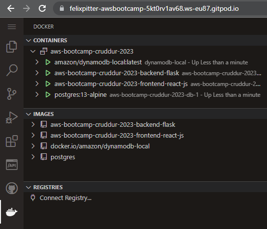
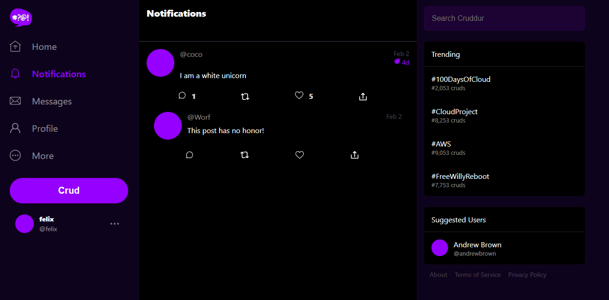
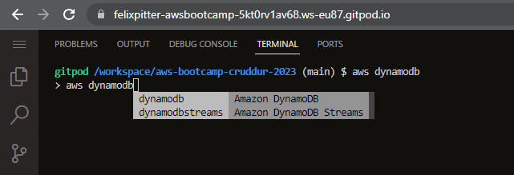
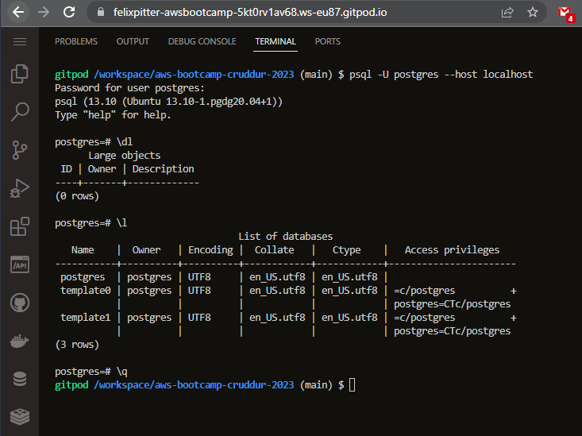
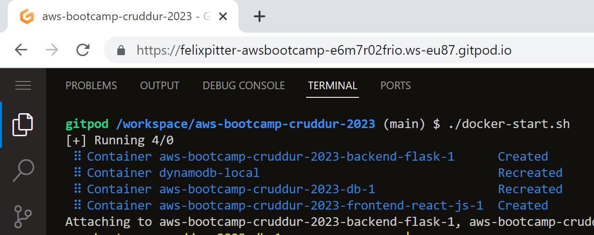
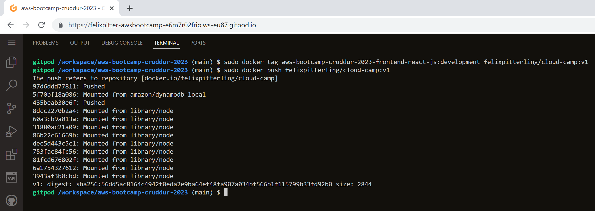
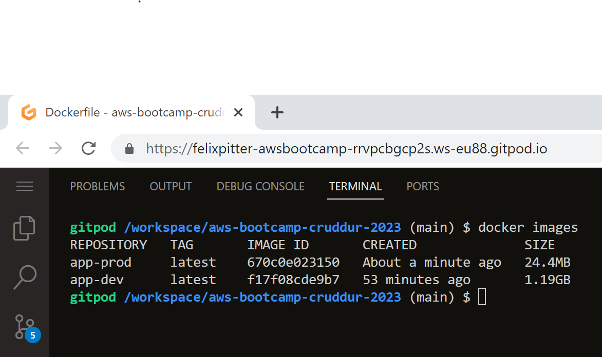
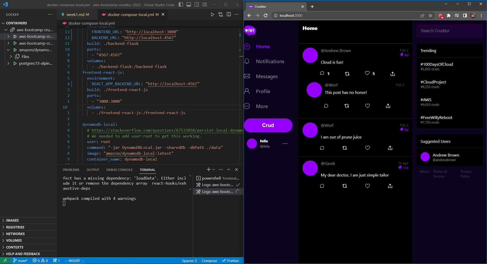

# Week 1 — App Containerization

## Homework

- [x] Containerize Application

  - After some issues with CORS and env vars I was able to get both the frontend and backend containers running. The problem was solved by switching to the GitPod web version instead of running GitPod through vscode on my local machine.

  

- [x] Document the Notification Endpoint for the OpenAI Document

  - Changed [openapi.yaml](./../backend-flask/openapi-3.0.yml) file

  - ```
    /api/activities/notifications:
    get:
      description: 'return a feed of activity for all of those that I follow'
      tags:
        - activities
      parameters: []
      responses:
        '200':
          description: Returns an array of activities
          content:
            application/json:
              schema:
                type: array
                items:
                  $ref: '#/components/schemas/Activity'
    ```

- [x] Write a Flask Backend Endpoint for Notifications

  - ````@app.route("/api/activities/notifications", methods=['GET'])
    def data_notifications():
    data = NotificationsActivities.run()
    return data, 200```
    ````
  - Created route in [notifications_activities.py](./../backend-flask/services/notifications_activities.py) and implemented it in [`app.py`](./../backend-flask/app.py)

- [x] Write a React Page for Notifications

  - Created [react page](./../frontend-react-js/src/pages/NotificationsFeedPage.js) for notifications and a corresponding [CSS file](./../frontend-react-js/src/pages/NotificationsFeedPage.css)
  - 

- [x] Run DynamoDB Local & Postgres
  - Added code to both [docker-compose](./../docker-compose.yml) and [GitPod config](./../.gitpod.yml) to install DynamoDB & Postgres in GitPod and to use them in Docker builds
  - Got both DynamoDB Local & Postgres running in containers (see image in Containerize Application task section)
  - DynamoDB CLI & Postgres Client:
    - 
    - 

## Homework Challenges

- [x] Run the dockerfile CMD as an external script

  - Created a shell script, [docker-start.sh](../docker-start.sh), to fun docker-compose.yml

  ```
   #!/bin/bash
   docker-compose up
  ```

  

- [x] Push and tag a image to DockerHub

  - [Repo Link](https://hub.docker.com/repository/docker/felixpitterling/cloud-camp/general)

  

- [x] Use multi-stage building for a Dockerfile build

  - [docker-compose file](./../docker-compose-multi-prod.yml)
  - [dockerfile file](./../frontend-react-js/Dockerfile) (Code is commented out and at the bottom of the file)
  - This task took be quite a long time however in the end I used this [guide](https://medium.com/geekculture/dockerizing-a-react-application-with-multi-stage-docker-build-4a5c6ca68166) as a guide. I used the docker multi stage builds feature to create a production build of the CRUDDUR frontend. The image size was reduce from 1.2GB to 24MB.
  - I installed and used nginx as a webserver
  - 

- [x] Implement a healthcheck

- I used this [article](https://scoutapm.com/blog/how-to-use-docker-healthcheck) to learn and implement a healthcheck into the [frontend dockerfile](./../frontend-react-js/Dockerfile)

- `HEALTHCHECK CMD curl --fail http://localhost:3000 || exit 1 `

- [x] Install docker & serve CRUDDUR locally

  - Installed Docker Desktop from their [homepage](https://www.docker.com/)
  - Created a modified [docker-compose](./../docker-compose-local.yml) file to things locally (ports, env var, ...)
  - CRUDDUR running:
    - 

## Class Notes

### _1. [LIVE] Containerization Overview_

- Helps with working with different versions

  - Operating Systems
  - Node, Python, ... version
  - Compiler versions

- Containerization takes a little getting used to but after some time things become simple and natural

- Dockerhub - "largest library and community for container images"

- jFrog - library for artifacts (like libraries)

- Docker stores images (GitHub stores code)

- Docker uses a layered approach

  - Host OS -> Container -> another OS

- Host & guest (docker) operating system

- `docker build -t  backend-flask ./backend-flask`

  - `-t` flag is used to tag the resulting image with a given name and optionally a tag
  - without any version tag, latest will be applied

- docker run

  - `docker run --help`
  - `docker run --rm -p 4567:4567 -it -e FRONTEND_URL='*' -e BACKEND_URL='*' backend-flask`

    - From chatGPT:

    - `--rm`: This flag tells Docker to automatically remove the container when it exits. This is useful to avoid leaving behind stopped containers that take up disk space.

    - `-p 4567:4567`: This flag maps the port 4567 of the container to the port 4567 on the host. This is necessary to allow traffic to reach the container's application.

    - `-it`: This flag creates an interactive terminal inside the container and attaches it to the current terminal, so you can interact with the container's command line. It's often used with -d (detach) to start the container in the background.

    - `-e FRONTEND_URL='*'`: This flag sets an environment variable named FRONTEND_URL with a value of \*. This can be used by the containerized application to access the URL of the frontend service, which can be running in a separate container or on a different host.

    - `-e BACKEND_URL='*'`: This flag sets an environment variable named BACKEND_URL with a value of \*. This can be used by the containerized application to access the URL of the backend service, which can be running in a separate container or on a different host.

    - `backend-flask`: This is the name of the Docker image to use when starting the container. It is required and should correspond to the image that was built with the docker build command.

- Container information: `docker ps` & `docker images`

- Docker compose allows you to run multiple containers at the same time. And let them interact with each other.

### _2. [NOT LIVE] Spend Considerations: GitPod, GitHub Codespaces, AWS Cloud9 and Cloudtrail (with Chirag Nayyar)_

- GitPod

  - 50 hours / month
  - 4 cores, 8GM RAM & 30GB storage
  - Best to run only one instance at a time
  - Calculator in gitpod.io is very useful
  - Instances stop automatically after 30 minutes

- GitHub Codespaces

  - 60 hours / month free on low settings (2 cores)

- AWS Cloud9

  - Uses EC2 (t2.micro instance)
  - Uses up EC2 free tier resources
  - Best to avoid since only one EC2 instance can run on free tier

- CloudTrail
  - Be careful with setting cloudtrail or avoid completely
    - Unselect SSE-KMS encryption
    - Only log management events
  - Still does 90-day review automatically

### _3. [NOT LIVE] Security Considerations: Top 10 Docker Container Security Best Practices (with Ashish Rajan)_

- Container security: practice of protecting your applications hosted on compute services (or locally)
- Container first strategy
  - No special requirements for running code
- Managed Container Service: AWS ECS, AWS EKS
- Un-Managed requires more resources to run (android vs iPhone comparison)

- Doctor Components

  - Docker Client (Build, Pull, Run features)
  - ↓ REST API ↓
  - Docher Server
    - Docker Daemon (Docker Host)
      - Containers
    - Registry (private or public)
      - Images

- Container Security Components Considerations

  - Docker & Host Configuration
  - Securing images
  - Secret management
  - Monitoring Containers
  - Data security
  - ...

- **Top 10 Practices**

  1. Keep host, docker updated
  2. Docker daemon & containers should run in non-root user mode
  3. Image Vulnerability Scanning
  4. Trusting a private vs public image registry
  5. No sensitive data in docker files or images
  6. Use secret management services
  7. Read only fs and volume for docker
  8. separate databases for long term storage
  9. Use DevSecOps practices while building application security
  10. Test code for vulnerabilities before production (including any dependencies)

- Snyk OpenSource Security to identify docker compose vulnerabilities

- AWS Secret Manager

  - Alternative: Hashicorp Vault (use AWS library underneath)
  - $0.4/months/secret

- AWS Inspector

  - Alternative: Clair
  - Used to secure images

- Snyk Container
  - Get an overview of your containers and their security information

```

```
