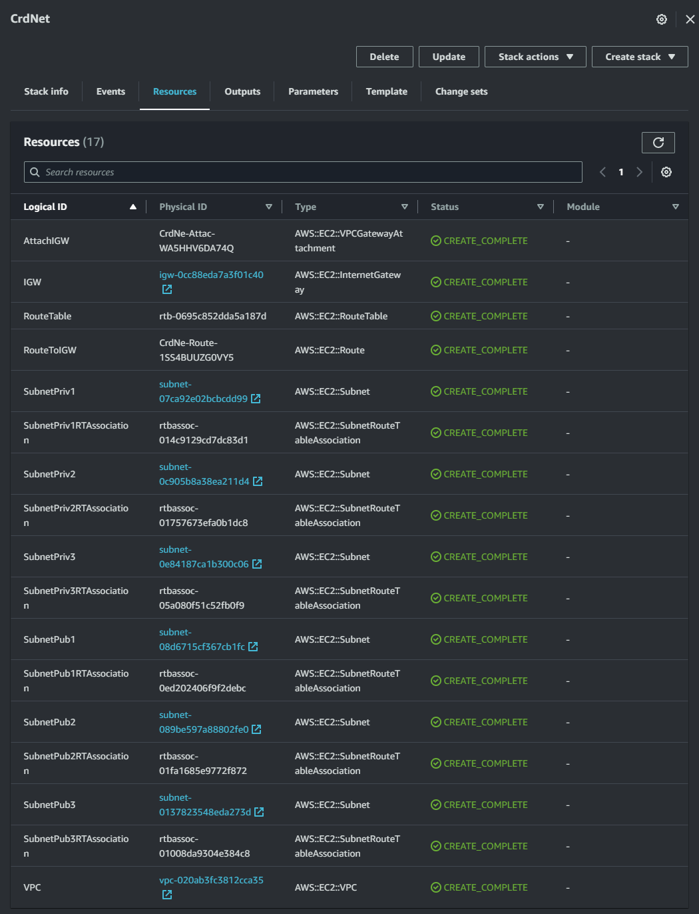
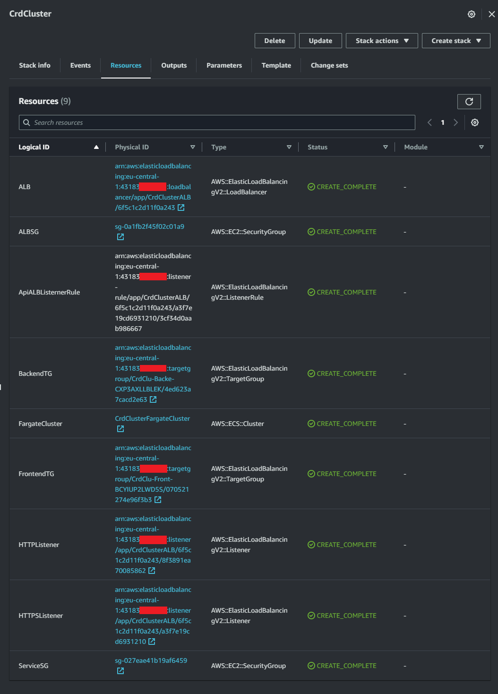
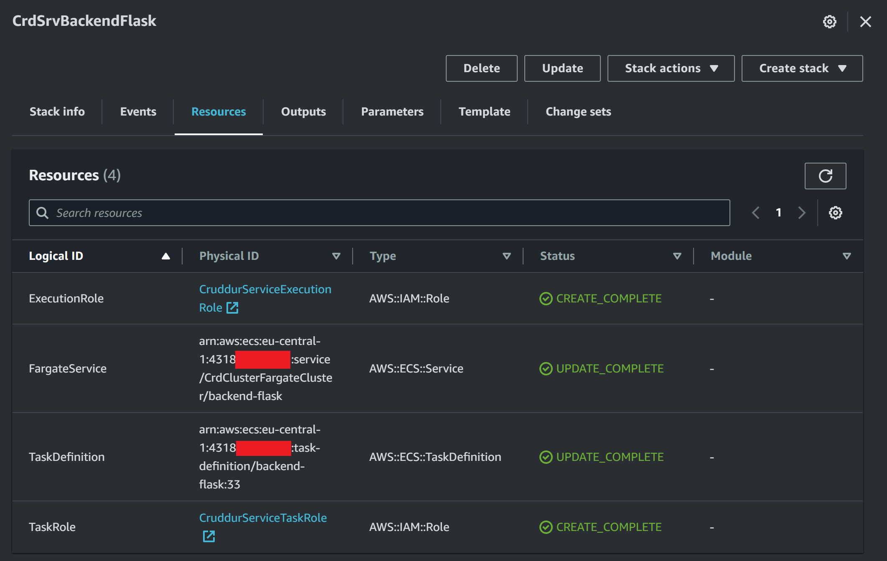
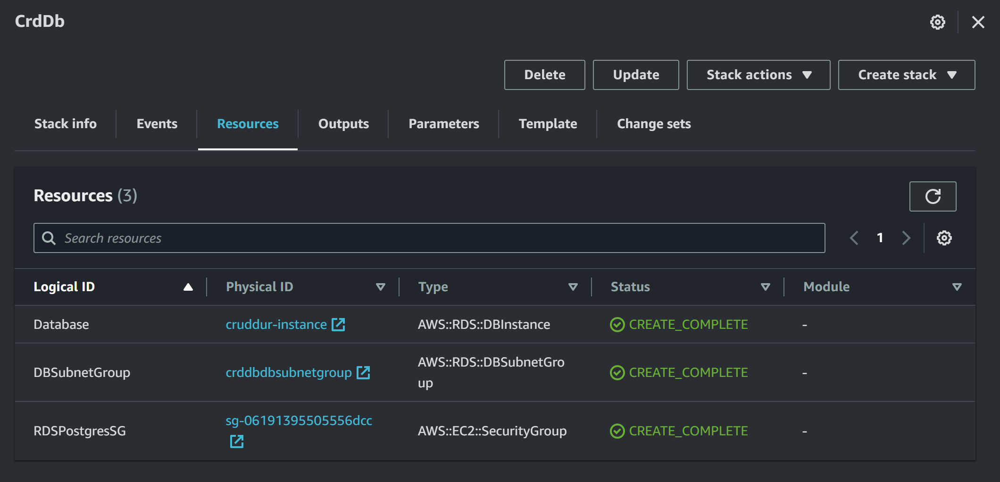
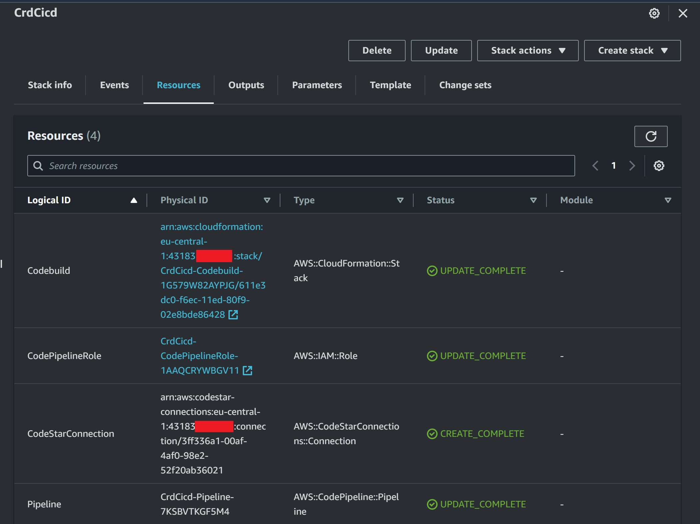
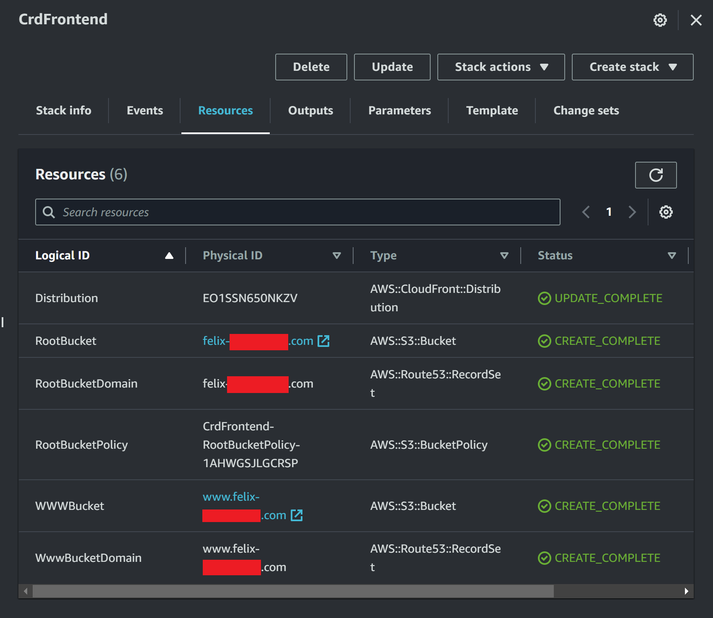
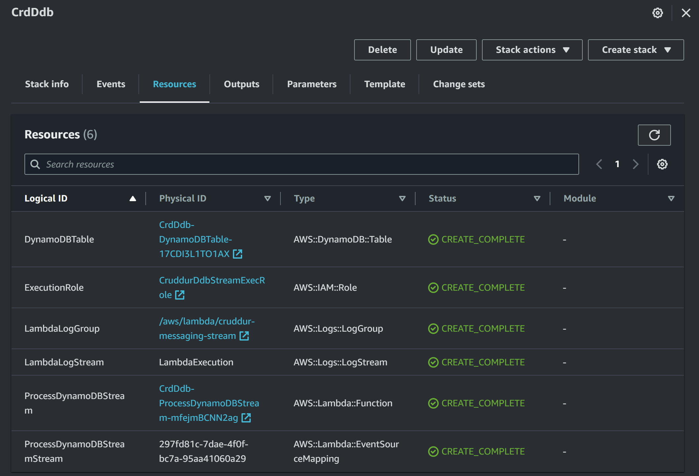
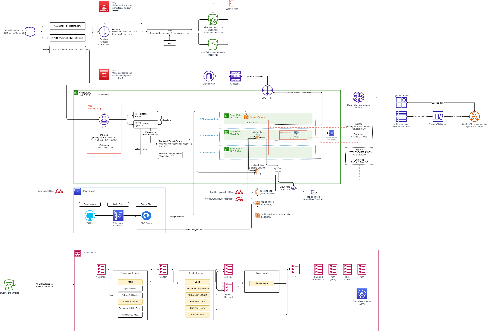

# Week 10 — CloudFormation Part 1

## Homework 
- [x] Implement CFN Toml
    - Added the line `gem install cfn-toml` to [gitpod.yml](./../.gitpod.yml) so that the package gets installed on startup of a new workspace
    - The variables now can be loaded into the deploy script like this: `BUCKET=$(cfn-toml key deploy.bucket -t $CONFIG_PATH)`
        - Toml Files:
            1. [cicd config.toml](./../aws/cfn/cicd/config.toml)
            2. [cluster config.toml](./../aws/cfn/cluster/config.toml)
            3. [db config.toml](./../aws/cfn/db/config.toml)
            4. [frontend config.toml](./../aws/cfn/frontend/config.toml)
            5. [networking config.toml](./../aws/cfn/networking/config.toml)
            6. [service config.toml](./../aws/cfn/service/config.toml)
            7. [ddb config.toml](./../ddb/config.toml)
            8. [sync config.toml](./../aws/cfn/sync/config.toml)

- [x] CFN Layers:
    - [x] Implement CFN Networking Layer
        - [networking deploy script](./../bin/cfn/networking)
        - [template.yaml](./../aws/cfn/networking/template.yaml)
        -  
    
    - [x] Implement CFN Cluster Layer
        - [cluster deploy script](./../bin/cfn/cluster)
        - [template.yaml](./../aws/cfn/cluster/template.yaml)
        -  
        

    - [x] Implement CFN Service Layer for Backend
        - [service deploy script](./../bin/cfn/service)
        - [template.yaml](./../aws/cfn/service/template.yaml)
        -  

    - [x] Implement CFN Database Layer (RDS)
        - [db deploy script](./../bin/cfn/db)
        - [template.yaml](./../aws/cfn/db/template.yaml)
        -  

    - [x] Implement CI/CD
        - [cicd deploy script](./../bin/cfn/cicd)
        - [template.yaml](./../aws/cfn/cicd/template.yaml)
        -  

    - [x] Implement CFN Static Website Hosting for Frontend
        - [frontend deploy script](./../bin/cfn/frontend)
        - [template.yaml](./../aws/cfn/frontend/template.yaml)
        -  

    - [x] Implement DynamoDB using SAM
        - [ddb build script](./../ddb/build)
        - [ddb package script](./../ddb/package) 
        - [ddb deploy script](./../ddb/deploy)
        - [template.yaml](./../ddb/template.yaml)
        -  

- [x] Diagramming 
    - [x] Implement CFN Networking Layer (Diagram)
    - [x] Implement Service and Database (Diagram)
    - [x] Implement DynamoDB (Diagram)
    - [x] Implement CI/CD (Diagram)
        -  

## Class Notes

### _1. [LIVE] CloudFormation Overview_

- Learning CloudFormation has a lot of benefits in the long run despite the services such as CDK

### _2. [NOT LIVE] CloudFormation Security Best Practices_

- AWS-Side:
    - Compliance standards
    - Amazon Organizations SCP
    - CloudTrail enabled
- Client-Side:
    - Do linting
        - No keys & secrets in code
    - Configuration access
    - Security of CFN entry points
    - Trusted source control
    - Vigorous CI/CD pipeline
