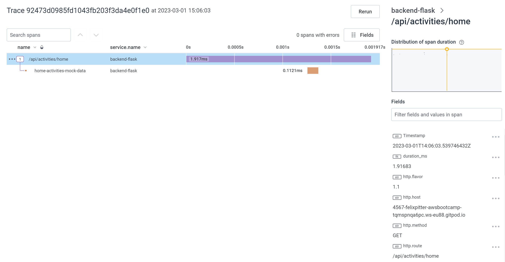
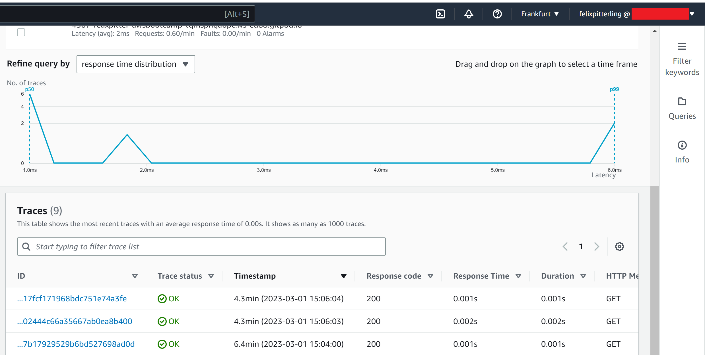
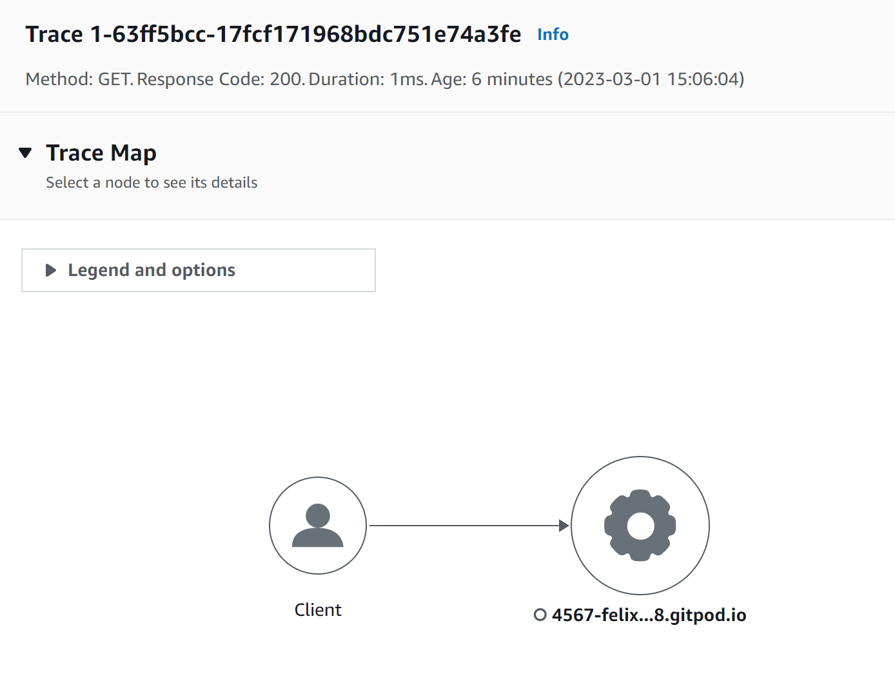
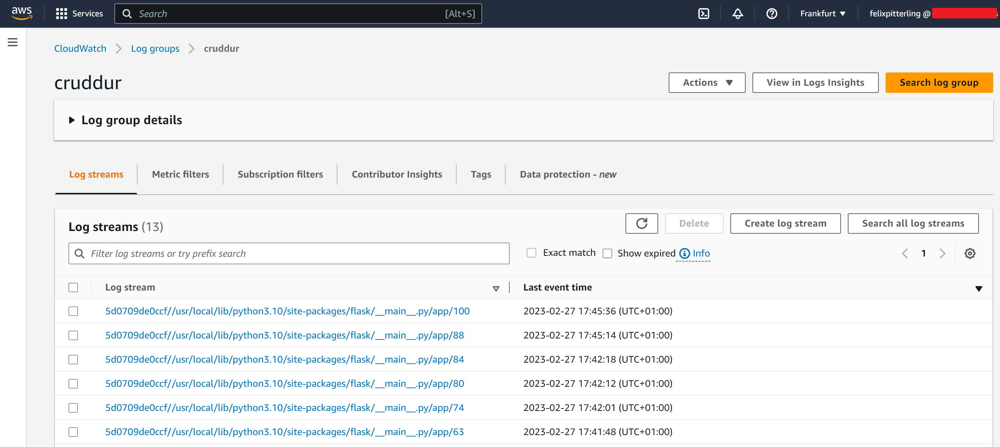
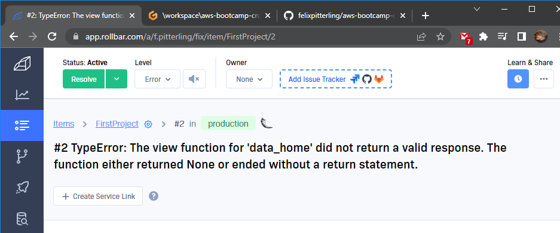
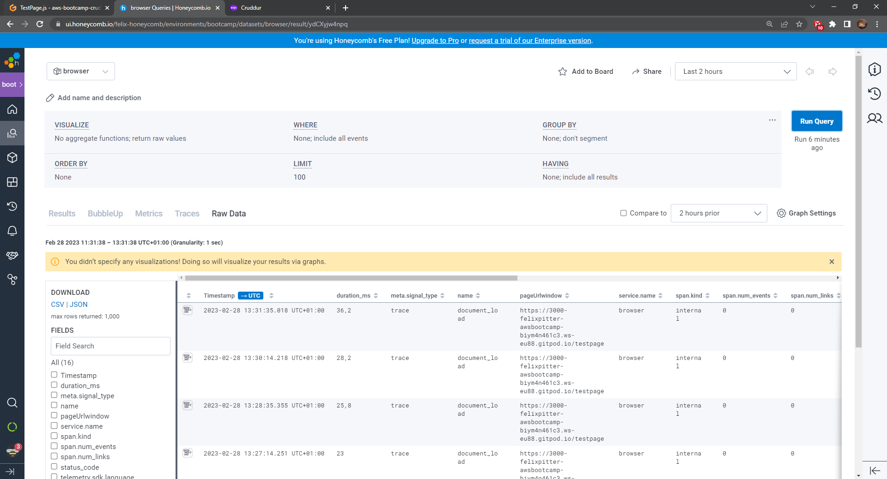
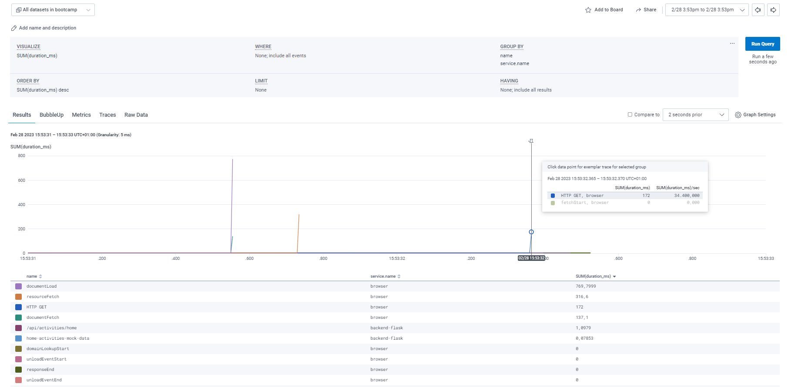
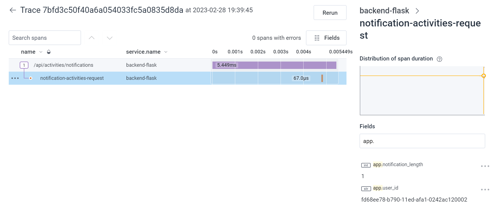
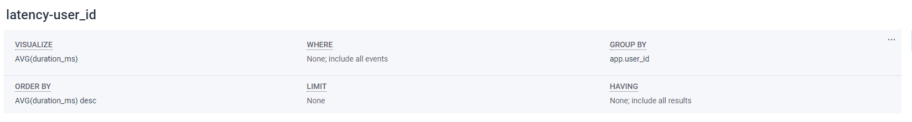
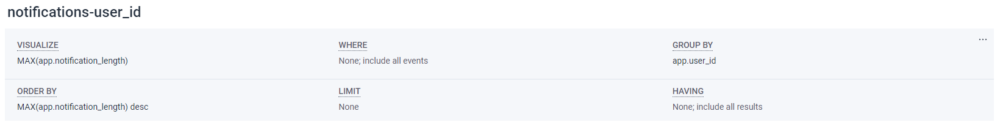

# Week 2 — Distributed Tracing

## Homework

- [x] Instrument Honeycomb with OTEL
  - For this task I first installed all relevant opentelemetry dependencies by adding to the [requirements.txt](./../backend-flask/requirements.txt) file

  - I then added the instrumentation code to the backend in the [app.py](./../backend-flask/app.py) file
  
  - I also added the needed env vars into the backend container in the [docker-compose](./../docker-compose.yml) file
  - Honeycomb site showing a trace:
  - 

- [x] Instrument AWS X-Ray
  - For this task I first installed `aws-xray-sdk` by adding to the [requirements.txt](./../backend-flask/requirements.txt) file

  - I then added the instrumentation code to the backend in the [app.py](./../backend-flask/app.py) and [user_activity.py](./../backend-flask/services/user_activities.py) files

  - X-Ray Dashboard:
  - 
  - 

- [x] Configure custom logger to send to CloudWatch Logs
    - For this task I first installed `watchtower` by adding to the [requirements.txt](./../backend-flask/requirements.txt) file
    - I then added the instrumentation code to the backend in the [app.py](./../backend-flask/app.py) and [home_activity.py](./../backend-flask/services/home_activities.py) files
    - Logs from the backend:
    - 
  
- [x] Integrate Rollbar and capture an error
    - For this task I first installed `blinker` and `rollbar` by adding them to the [requirements.txt](./../backend-flask/requirements.txt) file
    - I then added the instrumentation code to the backend in the [app.py](./../backend-flask/app.py) file
    - Testing Rollbar by creating error in backend:
    - 

## Homework Challenges

- [x] Instrument Honeycomb for the frontend-application to observe network latency between frontend and backend
    - For this task I followed the offical Honeycomb documentation on [Instrumenting Browser JavaScript Apps](https://docs.honeycomb.io/getting-data-in/opentelemetry/browser-js/) as well as some Google along the way. 
    - I installed all relevant opentelemetry dependencies using npm in the frontend folder
    - I then created the [tracing.js](./../frontend-react-js/src/tracing.js) file to configure direct access to Honeycomb (avoids the need for an OpenTelemetry Collector) and imported it into [index.js](./../frontend-react-js/src/index.js) so that the file is called automatically 
    - To test the setup so far I created the page [TestPage.js](./../frontend-react-js/pages/../src/pages/TestPage.js) which uses a span and an onload function to create a trace:
    - 
    - To create automatic tracing I used the `@opentelemetry/auto-instrumentations-web` package and added the required code along with the needed backend URL to [tracing.js](./../frontend-react-js/src/tracing.js) as well 
    - Finally I used Honeycomb's query feature to display both the frontend and backend when visting the home page for example:
    - 

- [x] Add custom instrumentation to Honeycomb using a new span to add more attributes
  - I added a user_id (hard coded for now) and notification_length attribute to a custom span inside [notifications_activities.py](./../backend-flask/services/notifications_activities.py)
  - 

- [x] Run custom queries in Honeycomb and save them later:
  - Average latency of each user:
  - 
  - Number of notifications of each user:
  - 

## Class Notes

### _1. [LIVE] Distributed Tracing Overview_

- Jessica's Introduction

  - Software (Programming) vs **Systems**
  - Software has the Debugger
  - Everything else uses **Observability**
    - Done by giving programms instructions to tell us what is going on
  - Traditional Logs vs Modern Observability
  - Observability uses **distributed tracing** to tell use a story
    - distributed tracing is used mostly in the backend

- Structure
  - Trace: collections of spans (single unit of time)
    - Tell use when things start and end
  - Spans can form trees to give us more details
- Service Map

  - Looks at all of your traces and shows relations (not needed)

- Instrumentation is the code that send the traces
- Observability tools: Tracing, Logging, Metrcis
- OTEL Standard & Cloud Native Foundation
- Heat map for latecny is the preffered tool
- Root spans contain only single calls

 

### _2. [NOT LIVE] Instrument XRay_

- AWS Observability Tool
  - Works best with lamda and serverless services
- Requires a daemon (not required in Honeycomb)
- Middleware is software for web applications that sits in between the client and your application (server)
  - Can handle authentication (white/black lists)
  - Make sure files are in the correct format and do not exceed a size limit

 

### _3. [NOT LIVE] Security Considerations: Observability vs Monitoring Explained in AWS (with Ashish Rajan)_

 

- Important assumptions:
  1. Application Workloads
  2. Monolith Applications (implementation - traditional)
  3. Microservice Applications (implementation - modern)
  4. Distributed Services
  5. Traditional Logging Systems

 

- Current state of logging:
  - On-Premise Logs
  - Cloud Logs
    - Infra and applications aspects will be different

 

- Why does logging suck?
  - Very time consuming spent analysing massive amounts of data

 

- Observability
  - Solves traditional logging probelms
  - Concept of concentrating on specific metrics
  - Benefits:
    1. Decreases alert fatigue for security ops teams
    2. Less time consuming process

 

- Observability vs Monitoring
  - Observability considers entire life cycles while monitoring is less detailed
  - Observability breaks down the entire application

 

- 3 Pillars of Observability
  1. Logs - Created by every applications
  2. Metrics - Enhances simple logs
  3. Traces - Provides a pin-point kind of analysis

 

- AWS realted services:
  - AWS CloudWatch Logs
  - AWS CloudWatch Metrics
  - AWS XRay Traces
  - Combining AWS loging and security requires more work to set up

 

- Instrumentation: Helps create/produce logs and metrics

 

- Potential security related metrics:
  - If a security group is changed do...
  - If a S3 bucket is exposed to the public do....

 

- Amazon Detective Service
  - Supports Amazon GuardDuty, AWS Security Hub, ...

 

- Building Security Metrics, Logs for Tracing:
  1. Start with threat modelling and identifying attack vectors
  2. Use existing complainace frameworks   
  3. Use in conjunction with Observability (ex: AWS Distro)

 

- Event Driven Security
  - using Amazon EventBridge and AWS Security Hub
  - severless 

