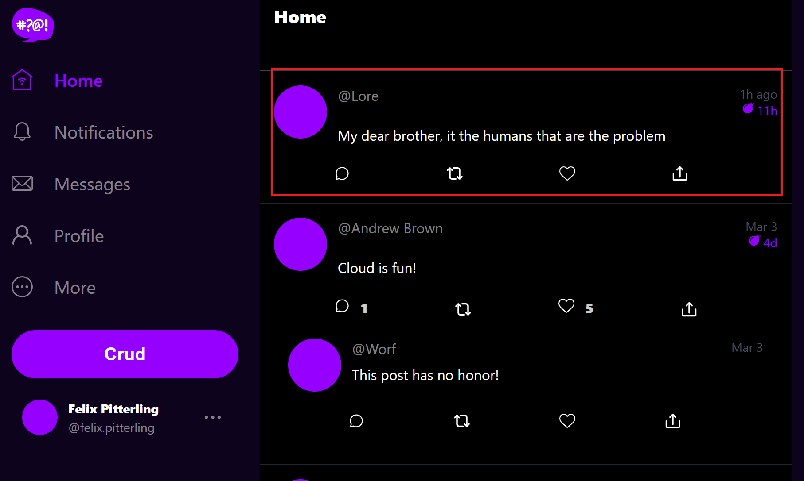
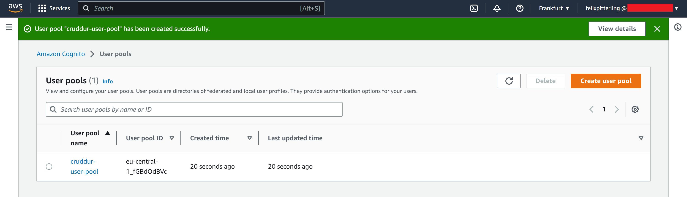
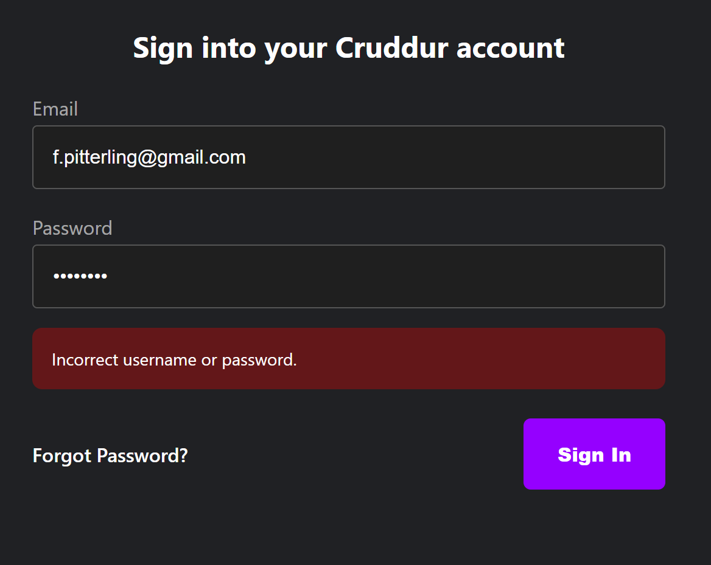
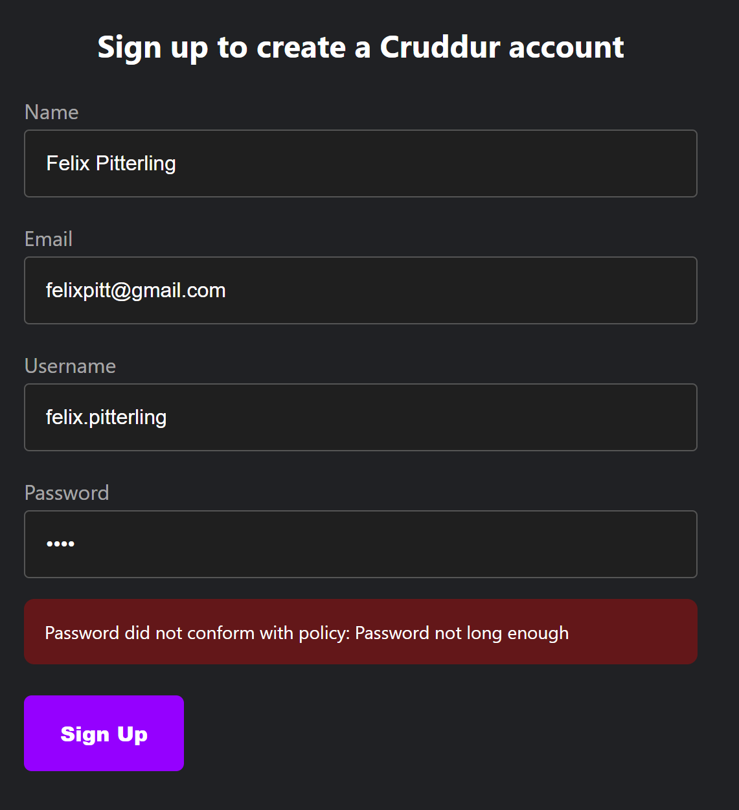
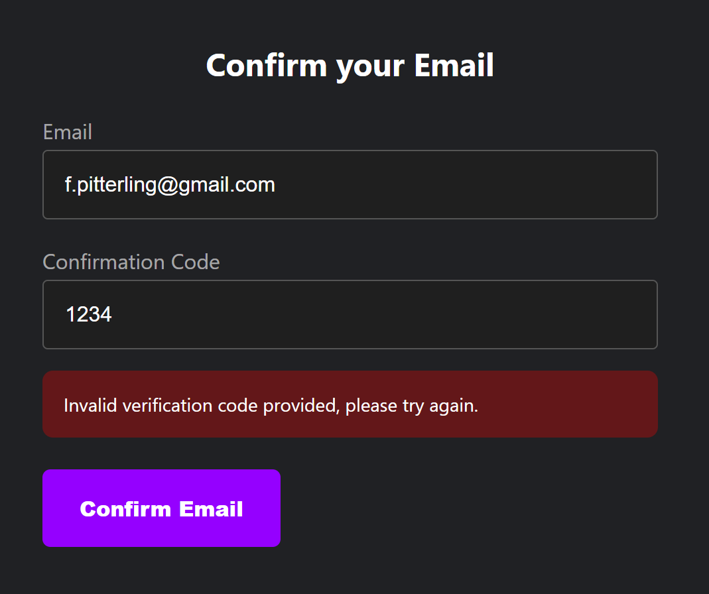

# Week 3 — Decentralized Authentication


## Homework Challenges

- [x] Setup JWT Authentication in app.py
  - Folled AB's video [Congito JWT Server side Verify](https://www.youtube.com/watch?v=d079jccoG-M)
  - Created the [cognito_jwt_token.py](./../backend-flask/lib/cognito_jwt_token.py) file and added all the required functions
  - Integrated [cognito_jwt_token.py](./../backend-flask/lib/cognito_jwt_token.py) into [app.py](./../backend-flask/app.py)
    - ```
      cognito_jwt_token = CognitoJwtToken(
        user_pool_id=os.getenv("AWS_COGNITO_USER_POOL_ID"), 
        user_pool_client_id=os.getenv("AWS_COGNITO_USER_POOL_CLIENT_ID"),
        region=os.getenv("AWS_DEFAULT_REGION")
      )
      ```
  - Added an extra mock data entry to [home_activities.py](./../backend-flask/services/home_activities.py) which is returned when logged in
    - Conditional logic:
      - ```
        if cognito_user_id != None:
          extra_crud = {
            ...
          }
        ```
    - Screenshot showing extra mock data:
        - 
    
- [x] Setup JWT Authentication using middleware
 
- [x] Setup MFA with Google Auth App
  - Follwed the guide [Multi-factor authentication](https://docs.amplify.aws/lib/auth/mfa/q/platform/js/) by Amplify Dev Center

## Homework

- [x] Setup Cognito User Pool
  - Added a user pool using the Cognito interface:
    - 
  - I also added the required React en vars in the [docker-compose file](./../docker-compose.yml)
- Cognito Frontend
  - [x] Implement Custom Signin Page
    - Added necessary code to [SinginPage.js](./../frontend-react-js/src/components/../pages/SigninPage.js)
    - ```
      Auth.signIn(email, password)
        .then(user => {
          localStorage.setItem("access_token", user.signInUserSession.accessToken.jwtToken)
          window.location.href = "/"
        })
      ```
    - Error thrown by signin page showing it is working:
      - 

  - [x] Implement Custom Signup Page
    - Added necessary code to [SingupPage.js](./../frontend-react-js/src/components/../pages/SignupPage.js)
    - ```
      const { user } = await Auth.signUp({
        username: email,
        password: password,
        attributes: {
          name: name,
          email: email,
          preferred_username: username,
        },
      ```
    - Error thrown by signup page showing it is working:
      - 
  - [x] Implement Custom Confirmation Page
    - Added necessary code to [ConfirmationPage.js](./../frontend-react-js/src/components/../pages/ConfirmationPage.js.js) 
    - ```
      await Auth.resendSignUp(email);
      console.log('code resent successfully');
      setCodeSent(true)
      ```
    - Error thrown by confirmation page showing it is working:
      - 
  
  - [x] Implement Custom Recovery Page
    - Added necessary code to [RecoverPage.js](./../frontend-react-js/src/components/../pages/RecoverPage.js)
    - ```
      Auth.forgotPasswordSubmit(username, code, password)
        .then((data) => setFormState('success'))
      ```
- [x] Watch about different approaches to verifying JWTs
  - I took notes in the **Class Notes**  section below


## Class Notes

### _1. [LIVE] Decentralized Authenication Overview_

- Teaching content on adding Cognito to a backend with a custom login page does not really exist 
- A user pool is simply a group of uesrs
- Auth flow: process of authenticating a user
- Amplify SDK needed to use Cognito
- Amplify vs Firebase

### _2. [NOT LIVE] Exploring JWTs_

- JWT - JSON Web Token

- Attributes can be passed with a JWTs
  - Can not be ensured to be only client-side which does not make a good solution

- aws-jwt-verify is javscript only
  - Must be careful with community alternatives

- Middleware
  - Sits outside of the app.py
  - Must be in the same langauge as the backend
  - "Little" decoupled 

- Sidecar
  - Container Pattern
  - Middleware in its own container outside backend container
  - Diffcult to orchestrate and expensive 
  - "More" decoupled 

- Using an API gateway
  - External middleware
  - Expensive
  - "Most" decoupled 

- JWTs use a specific protocol and are encoded 

### _3. [NOT LIVE] Security Considerations: Amazon Cognito Security Best Practices_

1. SAML/Single Sign On & Identity Provider
2. OpenID Connect
3. OAuth
    - Works together with OpenID and takes care of the authentication
    - Signin using credentials of another platform (GitHub, Google, ...)

- DeCentralized Authentication
- Amazon Cognito
  - User directory for customers that stores username, password, ...
  - Identity pool provides access to AWS services 

- User Lifecycle Management
  - Onboarding
  - Access and requirements can change
  - Offboarding

- Token Lifecycle Management

- Security Best Practices
  - AWS:
    - AWS WAF with Web ACLs for Rate limiting & Allow/Deny Lists
    - Follow compliance standards
    - Consider regions 
    - AWS CloudTrail to monitor malicious Cognito behaviour

  - Application:
    - Use industry auth standards (SAML, OpenID Connect, ...)
    - User & Token Access Lifecycle Management
    - Limited Access Token Scope
    - Encryption in transit for API Calls


