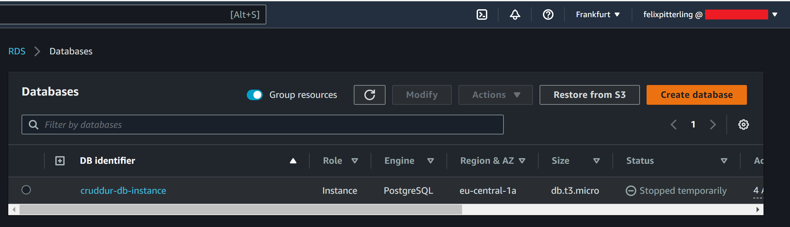
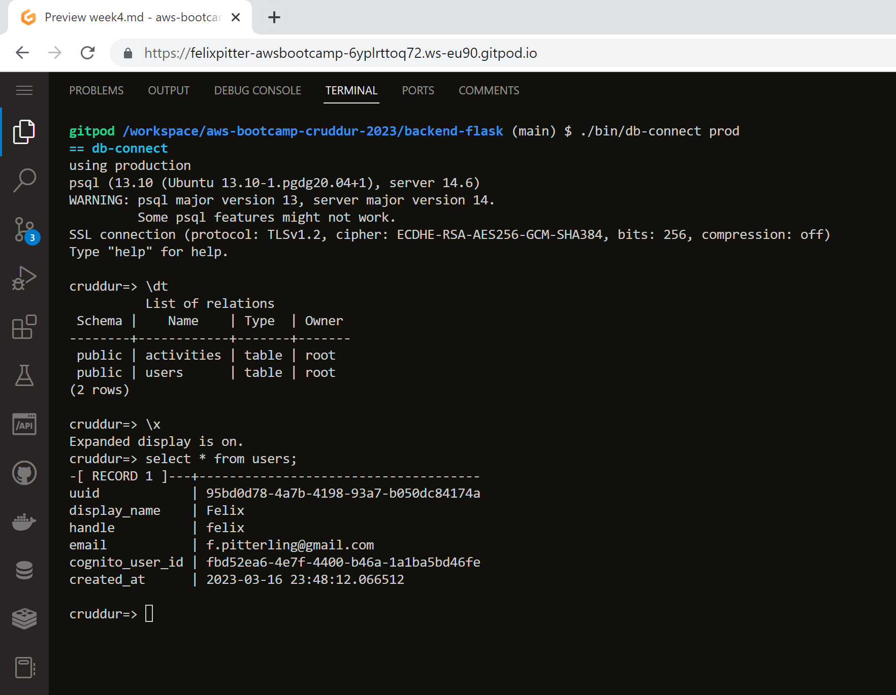
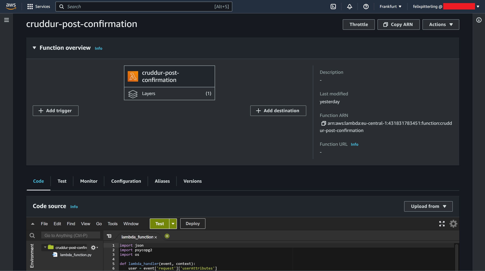
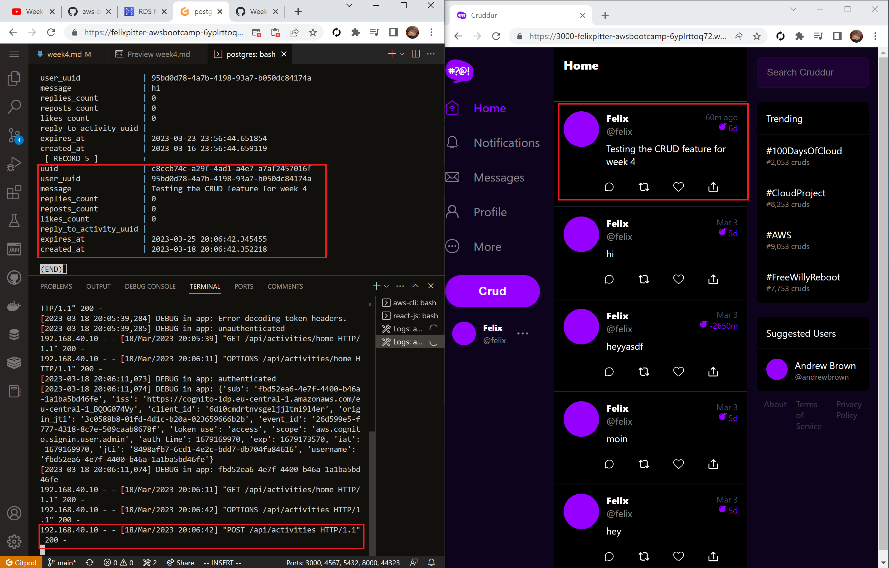

# Week 4 — Postgres and RDS

## Homework

- [x] Create RDS Postgres Instance
  - I used the following command with the AWS-CLI to create the Postgres instance:
    - ```
        aws rds create-db-instance \
            --db-instance-identifier cruddur-db-instance \
            --db-instance-class db.t3.micro \
            --engine postgres \
            --engine-version  14.6 \
            --master-username root \
            --master-user-password huEE33z2Qvl383 \
            --allocated-storage 20 \
            --availability-zone ca-central-1a \
            --backup-retention-period 0 \
            --port 5432 \
            --no-multi-az \
            --db-name cruddur \
            --storage-type gp2 \
            --publicly-accessible \
            --storage-encrypted \
            --enable-performance-insights \
            --performance-insights-retention-period 7 \
            --no-deletion-protection
      ```       
  - Screenshot of the RDS Dashboard:
    - 

- [x] Bash scripting for common database actions
  - I created the following bash scripts:
    1. [db-connect](./../backend-flask/bin/db-connect)
    2. [db-create](./../backend-flask/bin/db-create)
    3. [db-drop](./../backend-flask/bin/db-drop)
    4. [db-schema-load](./../backend-flask/bin/db-schema-load)
    5. [db-seed](./../backend-flask/bin/db-seed)
    6. [db-sessions](./../backend-flask/bin/db-sessions)
    6. [db-setup](./../backend-flask/bin/db-setup)

- [x] Install Postgres Driver in Backend Application
  - Added the `CONNECTION_URL` environment variable to [docker-compose.yml](./../docker-compose.yml)
    - Version for local dev is commented out. The active one refers to the prod version running as a RDS instance 
  - Added `psycopg` dependency to the backend in the [requirements.txt](./../backend-flask/requirements.txt) file and installed it using the command `pip install -r requirements.txt`

- [x] Connect Gitpod to RDS Instance
  - I first created the file [rds-update-sg-rule](./../backend-flask/bin/rds-update-sg-rule) which uses the command `aws ec2 modify-security-group-rules` to update the inbound rules of the default secuirty group such 
  that the IP address of the current Gitpod instance is allowed
  - That script was also added to the gitpod.yml so that it is started automatically
  - In the screenshot below I used the [db-connect](./../backend-flask/bin/db-connect) script to connect to the RDS Postgres instance. The script uses Psql in the background which is a interactive terminal for working with Postgres:
    - 

- [x] Create Cognito Trigger to insert user into database
  - For this task I used the AWS dashboard to create the Lambda function [cruddur-post-confirmation.py](./../aws/lambdas/cruddur-post-confirmation.py)

  - Lambda Dashboard:
    -  

  - I used the Cognito dashboard to set up the trigger

  - However, in the video [Creating Activities](https://www.youtube.com/watch?v=fTksxEQExL4) the Lambda function is updated. Using that code ended up throwing the error `function takes at most 2 arguments (5 given)` so I reverted to the original version. 

- [x] Create new activities with a database insert
  - For this task I closely follwed the video [Creating Activities](https://www.youtube.com/watch?v=fTksxEQExL4) by Andrew Brown. Overall this was the most difficult part of this week's homework given the large amount of new code and the few errors I ran into.

  <br />

  1. The [db.py](./../backend-flask/lib/db.py) contains useful functions to interact with the Postgres DB
  2. Adjusted [create_activity.py](./../backend-flask/services/create_activity.py) so that new CRUDs can be inserted into the DB
  3. Adjusted [home_activities.py](./../backend-flask/services/home_activities.py) so that CRUDs can be displayed onto the homepage
  4. The three following files ([create.sql](./../backend-flask/db/sql/activities/create.sql), [home.sql](./../backend-flask/db/sql/activities/home.sql), [object.sql](./../backend-flask/db/sql/activities/object.sql)) store common queries as templates 
  5. After not being able to create CRUDs I also adjusted the user_handle variable in [app.py](./../backend-flask/app.py) to the username of my cognito user

  <br />

  - Screenshot showing the creation of a new CRUD:
    - 


## Class Notes

### _3. [NOT LIVE] Security Considerations: Securing Your Amazon RDS Postgres Database_

  - Business use-case: RDS Postgres for Web application
  - SQL (ex: MySQL) vs NoSQL (ex: DocumentDB)
    - SQL uses rows and columns, NoSQL is more disconnected
  - Make sure the region is the same as the one which your users are in
  - Master username & password should be secure
  - Encryption should always be enabled 
  - Inbound and outbound rules
  - Best Practicies
    - Server-Side:
      1. Use VPCs
      2. Use compliance standards
      3. Region compliance
      4. Amazon Organizations SCP - Protects against unwanted deletions
      5. AWS CloudTrail is enabled & alerts are setup
      6. Amazon GuardDuty enabled
    - Client-Side
      1. Use IAM authentication, AWS KSM
      2. Encryption in transit and at rest
      3. Security group should be restricted to only known IPs
      4. RDS should not be internet accessible
  
  