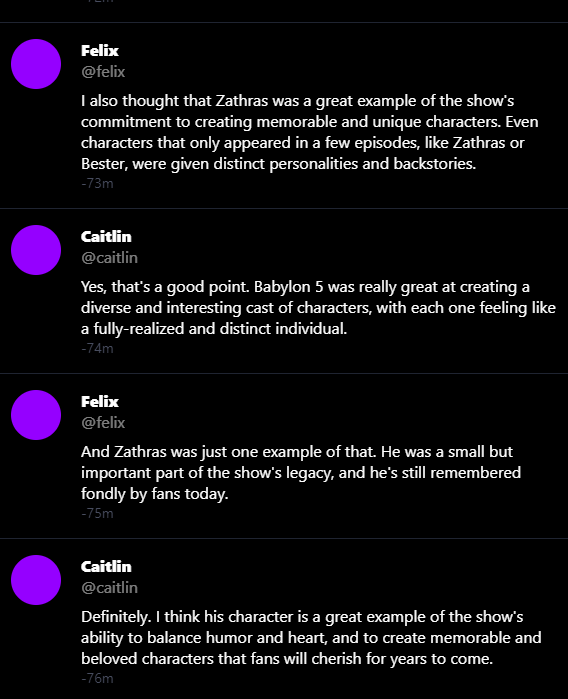
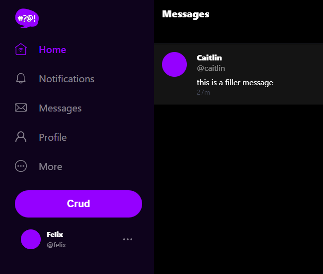
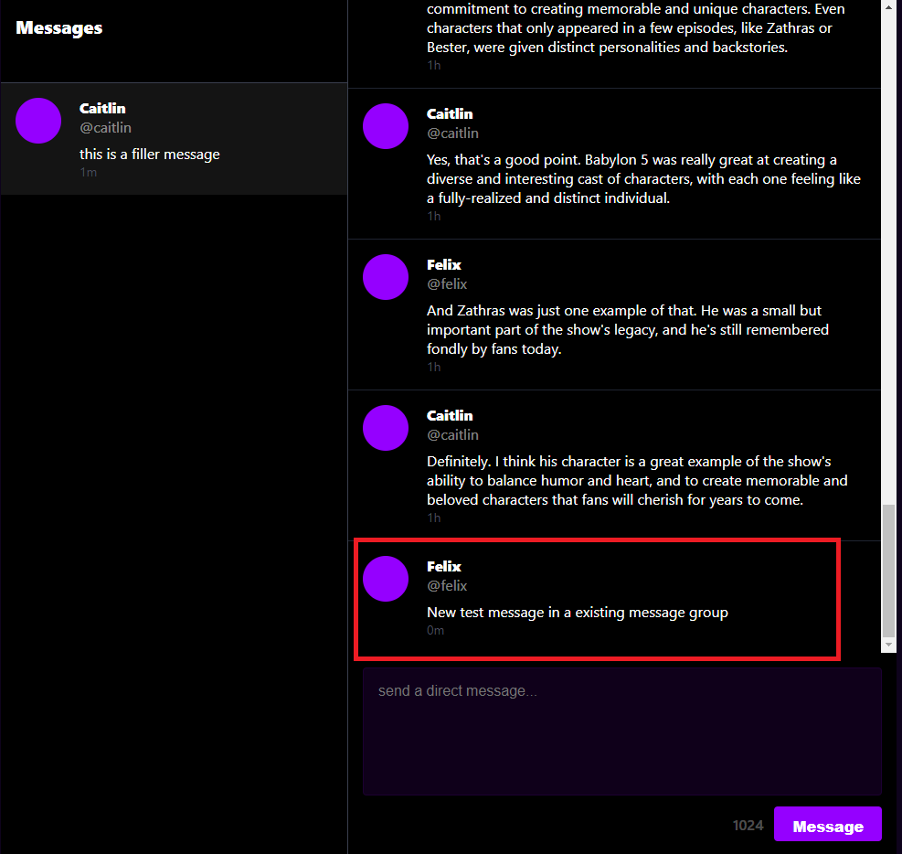
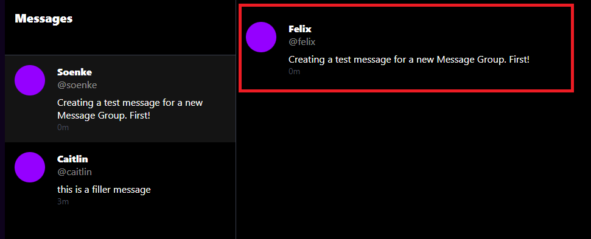
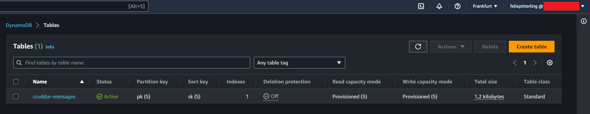
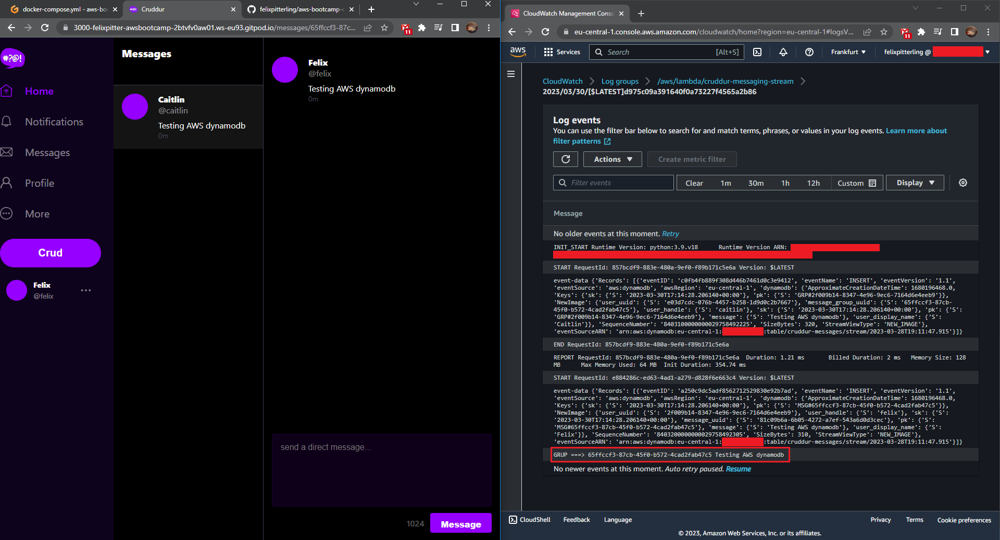

# Week 5 — DynamoDB and Serverless Caching

## Homework

- [x] Implement Schema Load, Seed & Scan Scripts
  - I created the following bash scripts by following the instructions:
    1. [schema-load](./../backend-flask/bin/ddb/schema-load)
         - `response = ddb.create_table(...)`
    2. [seed](./../backend-flask/bin/ddb/seed)
         - ```
            create_message(
              client=ddb,
              ...
            )
           ```
         - Later on I had some issues with new messages not being displayed. A discord user mentioned that the seed messages are created in the future. Changing how the timestamp is establised to the following helped:
           - `created_at = (now + timedelta(hours=-3) + timedelta(minutes=i)).isoformat()`
    3. [scan](./../backend-flask/bin/ddb/scan)
         - `response = table.scan()`
   
- [x] Implement Pattern Scripts for Read and List Conversations
  - I created the following python scripts by following the instructions:
    1. [get-conversation](./../backend-flask/bin/ddb/patterns/get-conversation)
    2. [list-conversations](./../backend-flask/bin/ddb/patterns/list-conversations)

- [x] Implement Update Cognito ID Script for Postgres Database
  - I created the [update_cognito_user_ids](./../backend-flask/bin/db/update_cognito_user_ids) bash script.   
  - I also changed the data entries in [seed.sql](./../backend-flask/db/seed.sql) to match entries in my cognito user pool
  
- [x] Implement (Pattern A) Listing Messages in Message Group into Application
  - For this task I added the function `list_messages()` to [ddb.py](./../backend-flask/lib/ddb.py) which takes in a `client` and `message_group_uuid`. The function runs a query using the pk and returns the data after formatting it as an array.
  - The function was integrated through [messages.py](./../backend-flask/services/messages.py) in [app.py](./../backend-flask/app.py) under the `/api/messages/<string:message_group_uuid>` route. 
  - [messages.py](./../backend-flask/services/messages.py) uses the [uuid_from_cognito_user_id.sql](./../backend-flask/db/sql/users/uuid_from_cognito_user_id.sql) template to interact with the databse 
  - 

- [x] Implement (Pattern B) Listing Messages Group into Application
  - For this task I added the function `list_message_groups()` to [ddb.py](./../backend-flask/lib/ddb.py) which takes in a `client` and `my_user_uuid`. The function runs a query using the pk and returns the data after formatting it as an array.
  - The function was integrated through [message_groups.py](./../backend-flask/services/message_groups.py) in [app.py](./../backend-flask/app.py) under the `/api/message_groups` route. 
  - Just like [messages.py](./../backend-flask/services/messages.py), [message_groups.py](./../backend-flask/services/message_groups.py) also uses the [uuid_from_cognito_user_id.sql](./../backend-flask/db/sql/users/uuid_from_cognito_user_id.sql) template to interact with the databse 
  - 
- [x] Implement (Pattern C) Creating a Message for an existing Message Group into Application
  - For this task I added the function `create_message()` to [ddb.py](./../backend-flask/lib/ddb.py) which takes in a `client`, `message_group_uuid`, `message`, `my_user_uuid`, `my_user_display_name`, `my_user_handle`. 
  - The function was integrated through [create_message.py](./../backend-flask/services/create_message.py) in [app.py](./../backend-flask/app.py) under the `/api/messages` route.
  - [create_message.py](./../backend-flask/services/create_message.py) also uses the [create_message_users.sql](./../backend-flask/db/sql/users/create_message_users.sql) template to interact with the database
  - New message in a existing message group:
    - 
- [x] Implement (Pattern D) Creating a Message for a new Message Group into Application
  - In addition to the `create_message()` function, a new function `create_message_group` was added to [ddb.py](./../backend-flask/lib/ddb.py) which takes in a `client`, `message`, `my_user_uuid`, `my_user_display_name`, `my_user_handle`, `other_user_uuid`, `other_user_display_name`, `other_user_handle`.
  - Creating a new message group uses the same route as Pattern C however now the argument mode="create" is passed instead of mode="update" when calling [create_message.py](./../backend-flask/services/create_message.py)
  - First message in a new message group:
    - 
- [x] Implement (Pattern E) Updating a Message Group using DynamoDB Streams
  - First I created a dynamodb instance through the AWS dashboad
    - 
  - Next I commented out the AWS_ENDPOINT_URL env var in the [docker-compose](./../docker-compose.yml) file so that the backend talks to AWS instance instead of my local one
  - I created a lambda function [cruddur-messaging-stream.py](./../aws/lambdas/cruddur-messaging-stream.py) and created a trigger with the dynamodb instance
  - Finally some policies also had to be updated
  - CloudWatch Logs showing the addition of a new message:
    - 


## Class Notes

### _1. [LIVE] NoSQL and Caching Overview_

- aka. DynamoDB and Serverless Caching
- DynamoDB stores key-value and document data
  - Can still be viewed as a table
- Data modelling is considered the most difficult aspect
- Caching application: direct messaging feature
- Pre-planning aspect is critical
- With NoSQL the "questions" that are asked are (at its best) pre-computed making it a inexpensive, fast and scalable solution
- Single table design
- Important questions: when? where? how fast? is data needed
- Access patterns: the way in which a program or system accesses data stored in memory
  - Pattern A (showing a single conversation)
  - Pattern B (list of conversation)
  - Pattern C (create a message)
  - Pattern D (update a message_group for the last message)
- Flat tables: Type of database table where all the data is stored in a single table
- PartiQL for DynamoDB (use SQL operations with NoSQL)
- Primary keys, partition keys and sort keys
- AWS NoSQL Workbench: Playground environment
- GSI & LSI:
  - Allows users to query data using an alternate key instead of the primary key
  - LSI vs GSI: The main difference between GSI and LSI is that GSI can be created on any attribute (and hence can be non-unique, get-item does not work) in a table, while LSI can only be created on attributes that are part of the table's sort key. 
- UUIDs are not always the best choice for a sort key
  - Rather check the data "you have on hand" 
- PK (Primary Key) / SK (Sort Key) Pattern

### _2. [NOT LIVE] Security Considerations:  Amazon DynamoDB for security and speed_

- AWS Side
  - Use VPC Endpoints
  - DynamoDB should only be used in the AWS region that you are legally allowed to be holding user data in
  - Amazon Organizations SCP - to manage delection, creation, ...
  - AWS CloudTrail is enabled
- Client Side
  - Use appropriate Authentication
  - Lifecycle management
  - IAM roles
  - DAX Service (IAM) Role to have read only access
  - Not internet access (instead VPC Endpoints)
  - Site to site VPN or direct connect for on-promise access
  - Client side encryption is recommended


