# Week 6 — Deploying Containers

## Homework

- [] Watch ECS Security by Ashish 
- [x] Watch Fargate Technical Questions with Maish
  - I watched the week 7 live class as well as the interview with Maish
  
- [x] Provision ECS Cluster
  - I provisioned the ECS Cluster with the command:
  - ```sh
    aws ecs create-cluster \
    --cluster-name cruddur \
    --service-connect-defaults namespace=cruddur
    ```
  - 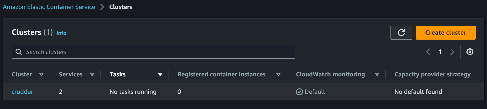

- [x] Create ECR repo and push image for backend-flask
  - First I created the repo with the command:
  - ```sh
    aws ecr create-repository \
    --repository-name backend-flask \
    --image-tag-mutability MUTABLE
    ```
  - Then  I used the [build](./../bin/backend/build) and [push](./../bin/backend/push) scripts in bin/backend
  - 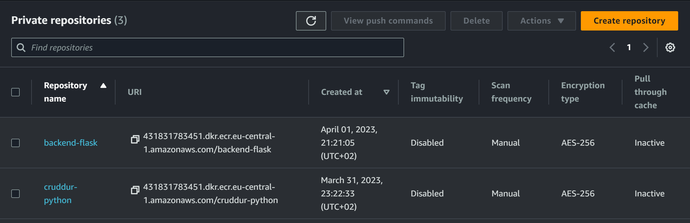
  
- [x] Deploy Backend Flask app as a service to Fargate
  - For this step I ran the [register](./../bin/backend/register) script which uses the [backend-flask.json](./../aws/task-definitions/backend-flask.json) as a task definition. 
  - Then I created the service with the command:
  - ```sh
    aws ecs create-service --cli-input-json file://aws/json/service-backend-flask.json
    ```
  - From then onwards I used the [deploy](./../bin/backend/deploy) script if there were any changes
  - 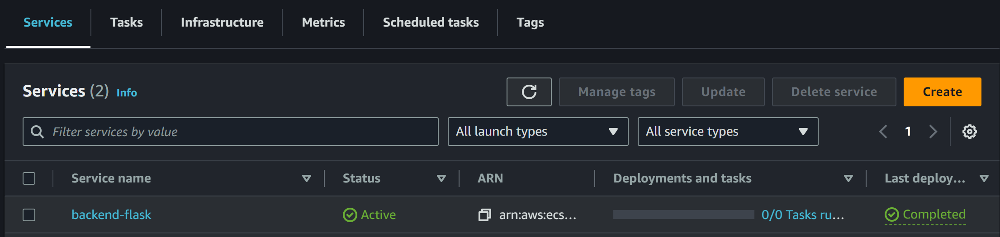

- [x] Create ECR repo and push image for fronted-react-js
  - First I created the repo with the command:
  - ```sh
    aws ecr create-repository \
    --repository-name frontend-react-js \
    --image-tag-mutability MUTABLE
    ```
  - Then  I used the [build](./../bin/frontend/build) and [push](./../bin/frontend/push) scripts in bin/frontend
  - 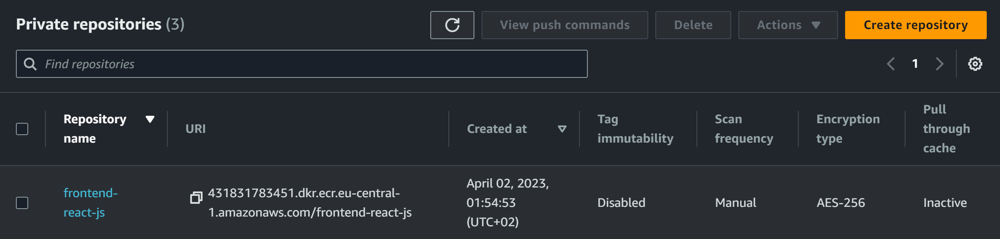


- [x] Deploy Frontend React JS app as a service to Fargate
  - For this step I ran the [register](./../bin/frontend/register) script which uses the [frontend-flask.json](./../aws/task-definitions/frontend-react-js.json) as a task definition. 
  - Then I created the service with the command:
  - ```sh
    aws ecs create-service --cli-input-json file://aws/json/service-frontend-react-js.json
    ```
  - From then onwards I used the [deploy](./../bin/frontend/deploy) script if there were any changes
  - 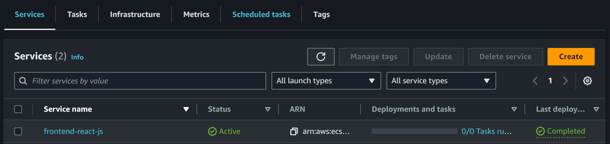

- [x] Provision and configure Application Load Balancer along with target groups
  - I simply followed the [ECS (Part 2)](https://www.youtube.com/watch?v=HHmpZ5hqh1I&list=PLBfufR7vyJJ7k25byhRXJldB5AiwgNnWv&index=60) without any problems
  - 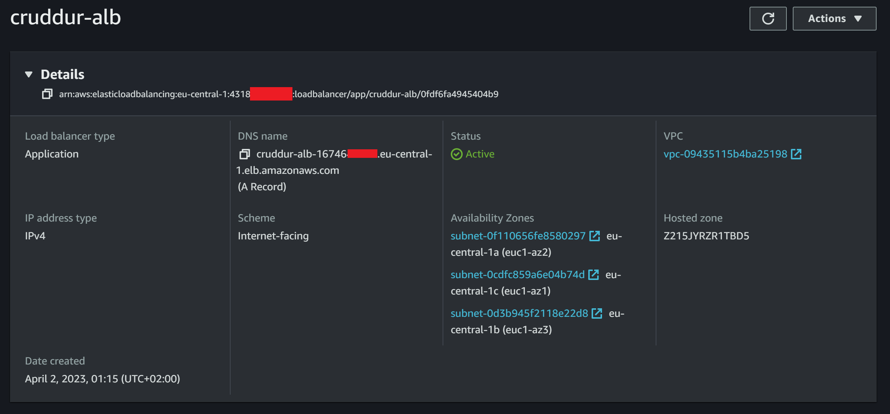
  - 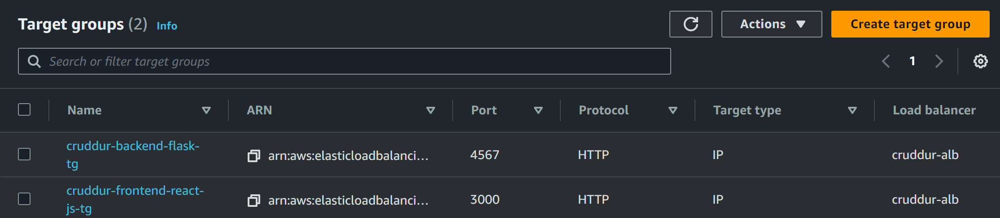
  
- [x] Manage your domain useing Route53 via hosted zone
  - 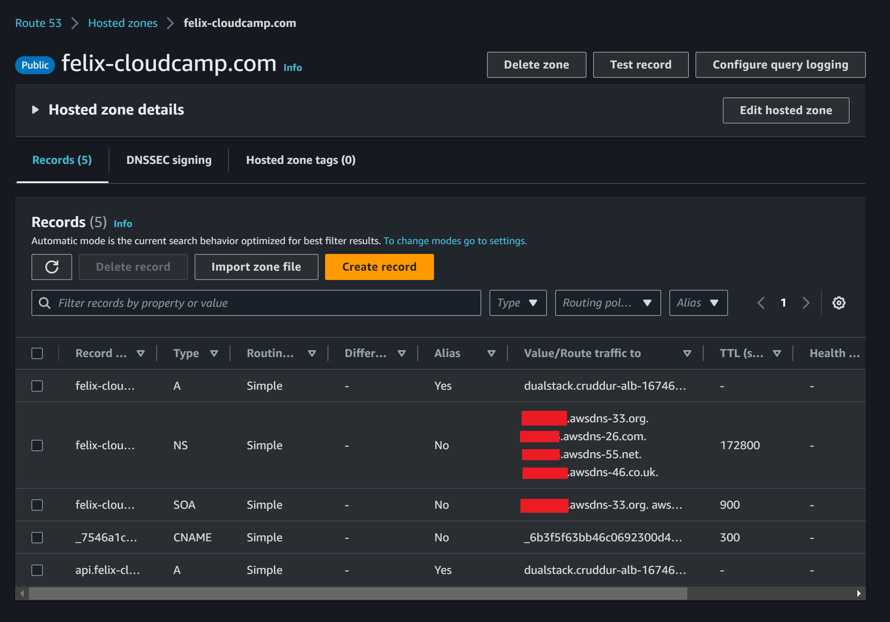
  - 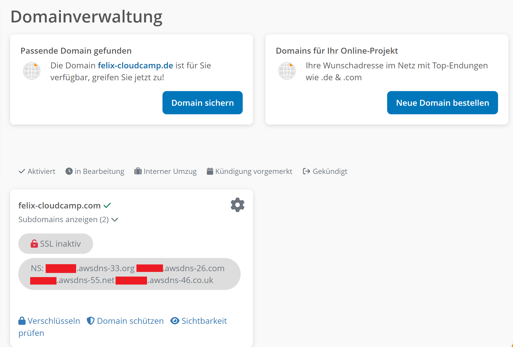

- [x] Create an SSL cerificate via ACM & setup records for the naked domain (frontend) & api subdomain (backend)
  - 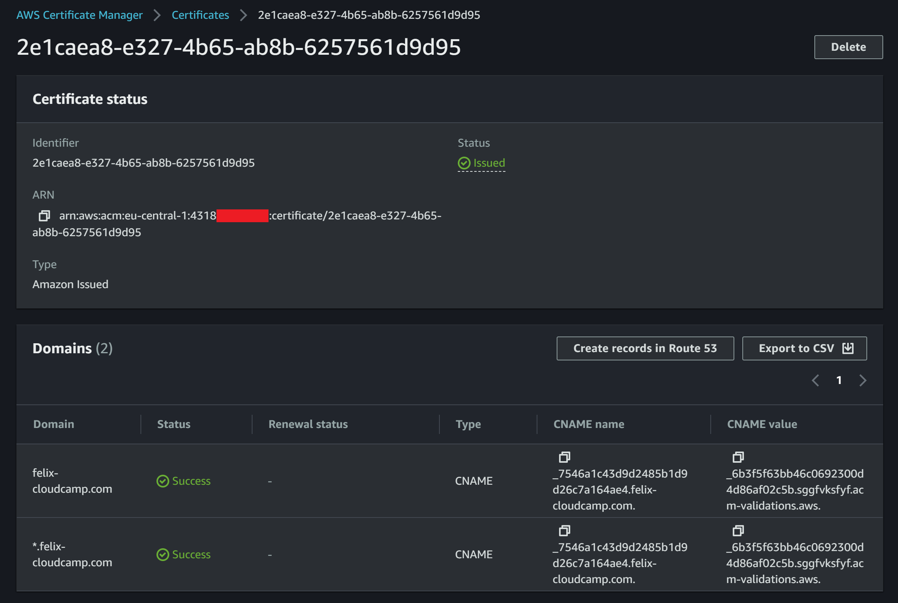

- [] Configure CORS to only permit traffic from our domain 
  
- [x] Secure Flask by not running in debug mode
  - To run the backend in debug mode, a new [Dockerfile.prod](./../backend-flask/Dockerfile.prod) was created. Most importantly the container is now run with the `--no-debug`,   `--no-debugger` and `--no-reload` flags.
  - As part of the instructional video a [build](./../bin/backend/build) and [run](./../bin/backend/run) scrips were written for the use with ease. They execute the `docker build` and `docker run` commands respectively.
  
- [x] Implement Refresh Token for Amazon Cognito
  - For this task a new function `getAccessToken` was created in [CheckAuth.js](./../frontend-react-js/src/lib/CheckAuth.js):
  - ```js
    export async function getAccessToken(){
      Auth.currentSession()
      .then((cognito_user_session) => {
        const access_token = cognito_user_session.accessToken.jwtToken
        localStorage.setItem("access_token", access_token)
      })
      .catch((err) => console.log(err));
    }
    ```
  - The function was then implemented in [MessageForm.js](./../frontend-react-js/src/components/MessageForm.js), [HomeFeedPage.js](./../frontend-react-js/src/pages/HomeFeedPage.js), [MessageGroupNewPage.js](./../frontend-react-js/src/pages/MessageGroupNewPage.js), [MessageGroupPage.js](./../frontend-react-js/src/pages/MessageGroupPage.js) and [MessageGroupsPage.js](./../frontend-react-js/src/pages/MessageGroupsPage.js)

- [x] Refactor bin directory to be top level
  - The new folder is now [bin](./../bin/) and contains all the updated scripts

- [x] Configure task defintions to contain x-ray and turn on Container Insights:
  - The following code was added to the `containerDefinitions` part of [backend-flask.json](./../aws/task-definitions/backend-flask.json) and [frontend-react-js](./../aws/task-definitions/frontend-react-js.json):
  - ```json
    {
      "name": "xray",
      "image": "public.ecr.aws/xray/aws-xray-daemon" ,
      "essential": true, 
      "user": "1337",
      "portMappings": [{
          "name": "xray",
          "containerPort": 2000,
          "protocol": "udp"
        }]
    }
    ```
  - 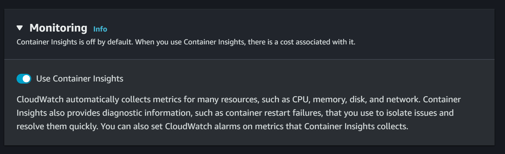
  - 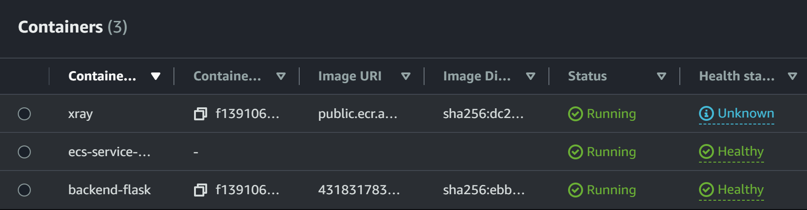


- [x] Change Docker Compose to explicitly use a user-defined network 
  - To create a user-defined network for containers to use, the following lines are added to [docker-compose.yml](./../docker-compose.yml)
  - ```yml
    networks: 
      cruddur-net:
        driver: bridge
        name: cruddur-net
    ```
  
- [x] Create Dockerfile specfically for production use case
  - Backend: [Dockerfile.prod](./../backend-flask/Dockerfile.prod)
  - Frontend: [Dockerfile.prod](./../frontend-react-js/Dockerfile.prod)

- [x] Using ruby generate out env dot files for docker using erb templates
  - Template files: [backend-flask.env.erb](./../erb/backend-flask.env.erb), [frontend-react-js.env.erb](./../erb/frontend-react-js.env.erb)
  - [backend generate-env](./../bin/backend/generate-env), [frontend generate-env](./../bin/frontend/generate-env)


## Class Notes

### _1. [LIVE] Deploying Containers Overview_

- Containers can be deployed to various services, such as:
    1. ECS EC2
    2. Lambdas
    3. Elastic Beanstalk
    4. ECS Fargate
        - Serverless option
        - Migrates well to EKS
        - Not free 
    5. Kubernetes (EKS)
    6. ...

- What is a service mash?
  - A service mesh is a dedicated infrastructure layer that manages service-to-service communication within a microservices architecture. It provides features such as traffic management, service discovery, load balancing, encryption, and authentication

- Network modes
  - Host mode
  - Bridge mode
  - AWS VPC mode
