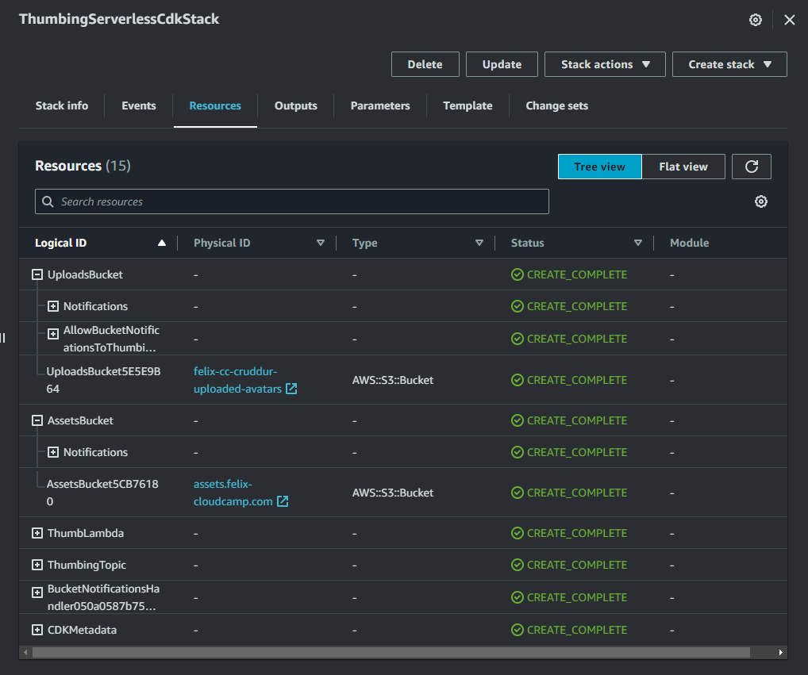
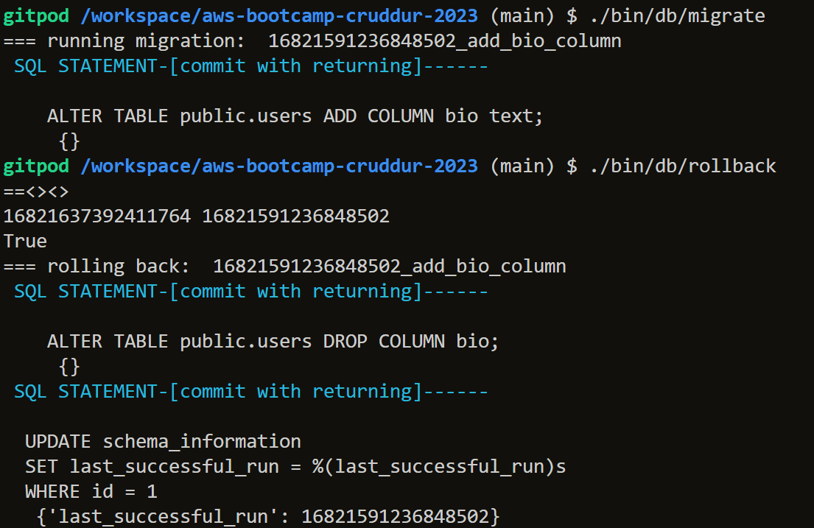

## Homework

- [x] Implement CDK Stack

  - I learned about and implemented the CDK stack using both the live and after-class videos
  - The configuration was done in [thumbing-serverless-cdk-stack.ts](./../thumbing-serverless-cdk/lib/thumbing-serverless-cdk-stack.ts). Overall we deploy/load two S3 Buckets, a Lambda and SNS notifications.
  - Important variables are defined in [.env](./../thumbing-serverless-cdk/.env)
  - The Lambda uses the JS and the library `sharp`. The code sits in [index.js](./../aws/lambdas/process-images/index.js) and [s3-image-processing.js](./../aws/lambdas/process-images/s3-image-processing.js)
  - The `cdk deploy` command is used to push the stack to CloudFormation:
    - 
    - 

- [x] Serve Avatars via CloudFront

  - First CloudFront was setup up by creating a distribution:
    - 
  - After further implementing and adjusting the files from CDK-Stack step I was able to access an image from the set domain [.env](./../thumbing-serverless-cdk/.env). In the end, uploading a file would resize it using the lambda ([index.js](./../aws/lambdas/process-images/index.js)) and put it in another bucket.
    - 
    - 

- [x] Implement Users Profile Page

  - Backend:
    - Adjusted [user_activities.py](./../backend-flask/services/user_activities.py) which uses [show.sql](./../backend-flask/db/sql/users/show.sql):
      - ```js
        class UserActivities:
          def run(user_handle):
            model = {'errors': None,'data': None}

            if user_handle == None or len(user_handle) < 1:
              model['errors'] = ['blank_user_handle']

            else:
              sql = db.template('users', 'show')
              results = db.query_object_json(sql, {'handle': user_handle})
              model['data'] = results
        ```
  
  - Frontend:
    - The following files were created:
      - [EditProfileButton.js](./../frontend-react-js/src/components/EditProfileButton.js), [EditProfileButton.css](./../frontend-react-js/src/components/EditProfileButton.js)
      - [ProfileHeading.js](./../frontend-react-js/src/components/ProfileHeading.js), [ProfileHeading.css](./../frontend-react-js/src/components/ProfileHeading.css)
    - The following files were modified:
      - [ActivityFeed.js](./../frontend-react-js/src/components/ActivityFeed.js)
      - [CrudButton.js](./../frontend-react-js/src/components/CrudButton.js)
      - [DesktopNavigation.js](./../frontend-react-js/src/components/DesktopNavigation.js)
      - [UserFeedPage.js](./../frontend-react-js/src/pages/UserFeedPage.js)
      - [HomeFeedPage.js](./../frontend-react-js/src/pages/HomeFeedPage.js)
      - [NotificationsFeedPage.js](./../frontend-react-js/src/pages/NotificationsFeedPage.js)
  
      -  


- [x] Implement Users Profile Form
  - Added [ProfileForm.js](./../frontend-react-js/src/components/ProfileForm.js) & [ProfileForm.css](./../frontend-react-js/src/components/ProfileForm.css) 
   
  
- [x] Implement Backend Migrations
  - Created the [migration](./../bin/generate/migration) script:
    - ```python
      def migrate():
        db.query_commit({klass}Migration.migrate_sql(),{{}})
      def rollback():
        db.query_commit({klass}Migration.rollback_sql(),{{}})
      ```
  - Added the [migrate](./../bin/db/migrate) and [rollback](./../bin/db/rollback) utility scripts
  - Example migration: [16821591236848502_add_bio_column.py](./../backend-flask/db/migrations/16821591236848502_add_bio_column.py)
  -  
  -  
  
- [x] Presigned URL generation via Ruby Lambda
  - Created the Lambda `CruddurAvatarUpload` which runs [function.rb](./../aws/lambdas/cruddur-upload-avatar/function.rb) and uses the policy [s3-upload-avatar-presigned-url-policy.json](./../aws/policies/s3-upload-avatar-presigned-url-policy.json)
    - ```ruby
      s3 = Aws::S3::Resource.new
      bucket_name = ENV["UPLOADS_BUCKET_NAME"]
      object_key = 'mock.jpg'

      obj = s3.bucket(bucket_name).object(object_key)
      url = obj.presigned_url(:put, expires_in: 60 * 5)
      ```

- [x] HTTP API Gateway with Lambda Authorizer
  - Created the Lambda `CruddurApiGatewayLambdaAuthorizer` which runs [index.js](./../aws/lambdas/lambda-authorizer/index.js) and uses the `CognitoJwtVerifier` library
    - ```js
      const jwtVerifier = CognitoJwtVerifier.create({
        userPoolId: process.env.USER_POOL_ID,
        tokenUse: "access",
        clientId: process.env.CLIENT_ID     
      });
      ```
- [x] Create JWT Lambda Layer
  - After running into CORS, 500 and 403 Errors I followed *Beici Liang* suggestion which skips the layer of JWT and directly passed the JWT sub from `CruddurApiGatewayLambdaAuthorizer` to the `CruddurAvatarUpload` Lambda.

- [x] Render Avatars in App via CloudFront
  - Created the component [ProfileAvatar.js](./../frontend-react-js/src/components/ProfileAvatar.js), [ProfileAvatar.css](./../frontend-react-js/src/components/ProfileAvatar.css) and implemented it in [ProfileHeading.js](./../frontend-react-js/src/components/ProfileHeading.js), [ProfileInfo.js](./../frontend-react-js/src/components/ProfileInfo.js) and [UserFeedPage.js](./../frontend-react-js/src/pages/UserFeedPage.js)
  -  

## Class Notes

### _1. [LIVE] Serverless Image Processing_

- CDK = Infrastructure as Code (IaC)
- Can work with CloudFormation (JSON, YAML)
- AWS CDK is open-source
- CDK works well with other IaC tools
- Versions 1, 2
- **Constructs** Concept
  - L1 (Low-Level - CloudFormation level, CFN Resources)
  - L2 (Higher-Level, ex: S3 Buckets)
  - L3 (Patterns, Different types of cloud resources)
- Reduced complexity compared to CloudFormation
- **The CDK Book**
