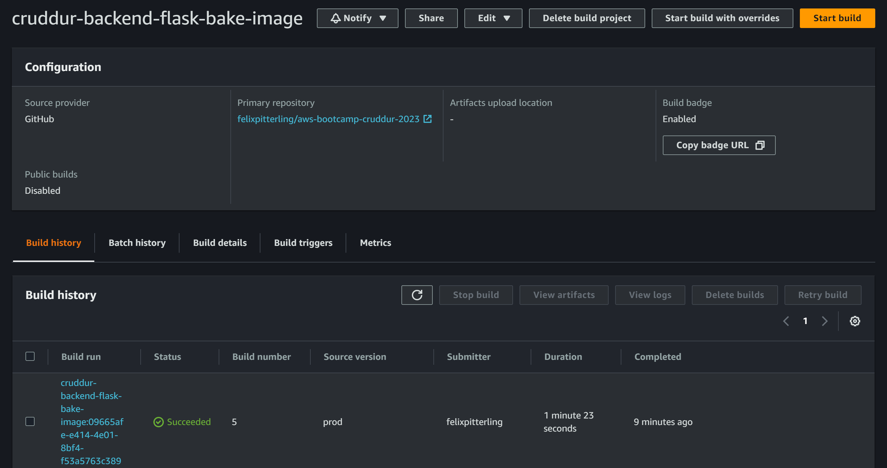
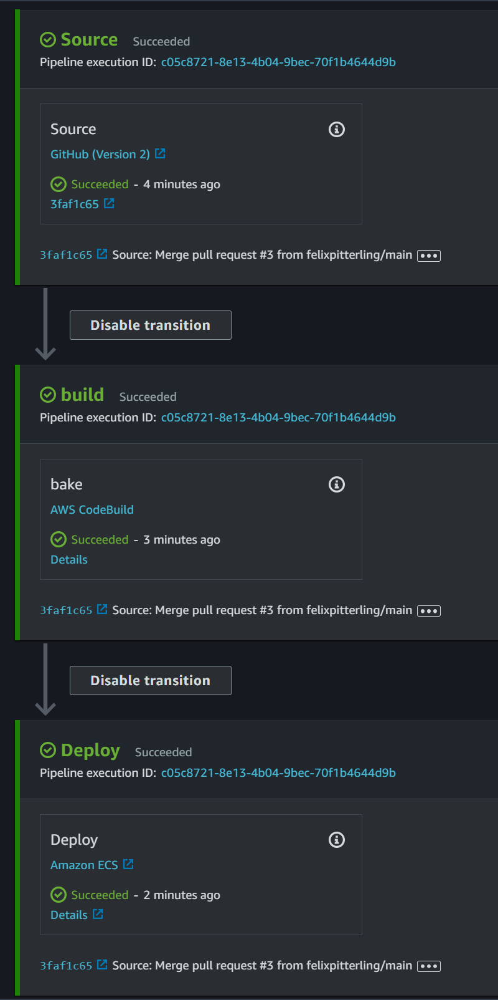
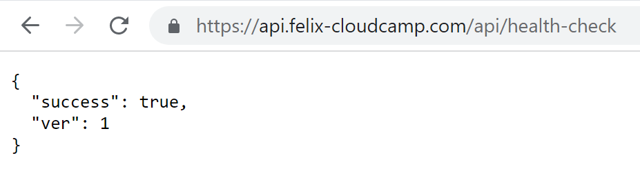
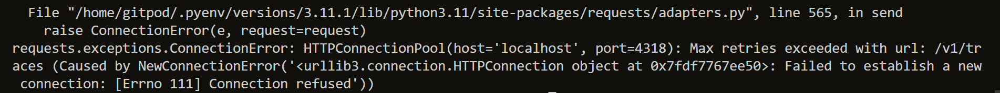
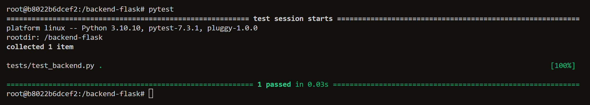
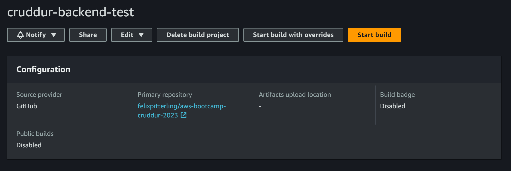
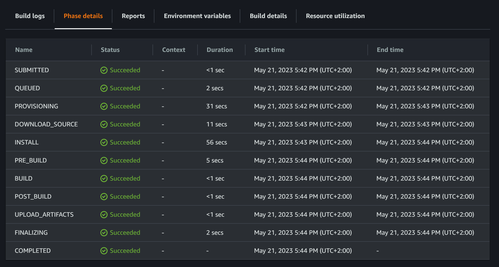
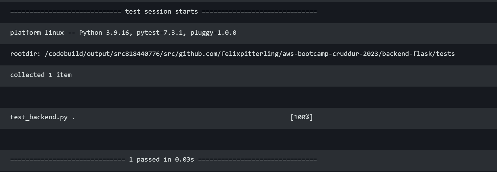

# Week 9 — CI/CD with CodePipeline, CodeBuild and CodeDeploy

## Homework 

- [x] CICD Pipeline Security
  - Find my [notes](https://github.com/felixpitterling/aws-bootcamp-cruddur-2023/blob/main/journal/week9.md#2-not-live-cicd-pipeline-security-explained-for-aws) below


- [x] Configuring CodeBuild
  - Using the [buildspec.yml](./../backend-flask/buildspec.yml) file I created a CodeBuild Project
  - The [buildspec.yml](./../backend-flask/buildspec.yml) is divided in `install`, `build` and `post_build` stages. It instruct too pull the repo, build the image and finally push the image to ECR
  -   


- [x] Configuring CodePipeline
  - Configuring CodePipeline was a matter of chaining the `source`, `build` and `deploy` stages together using the UI
    -   
  
  - The deploy was tested by changing the response of the health-check route (`/api/health-check`) to `{'success': True, 'ver': 1}, 200`
    -    

## Homework Challenges

- [x] Implementing Test Stage
  - I spent a lot of time researching how to do this challenge. First I was set on using Jenkins on an EC2 instance, however I could not find any guide online that used Jenkins **just** for the test stage. I wanted to avoid building the image twice.
  
  - I then moved onto keeping it simple with the testing feature provided by CodeBuild. I did this my adding the following code to the [buildspec.yml](./../backend-flask/buildspec.yml): 

    - ```yml
      pre_build:
        commands:
          - echo Running pre-build tasks...
          - cd $CODEBUILD_SRC_DIR/backend-flask
          - pytest unit-test.py
      ```
  - In the new `pre_build` section `pytest` (which was also added to [requirements.txt](./../backend-flask/requirements.txt)) is used to call a simple test that hits the health-check endpoint. The test is in [unit-test.py](./../backend-flask/unit-test.py). However, even after longer tinkering I could not get it work (flask was running):
    -   
  - I also tried the recommended way of adding a test directly in CodePipeline using a secondary CodeBuild Project and `buildspec.yml` file
  - I decided to move on for now as I am currently behind. CI/CD is very new to me and I am still happy that I took some time to learn about build servers.

  ### Second Attempt
  - For the second attempt I created a new [buildspec.yml](./../backend-flask/tests/buildspec.yml) file which runs a test using `pytest` in the `build phase` after running `pip3 install -r requirements.txt` in the `install phase`:
    - ```yml
      build:
        commands:
          - echo "testing start"
          - cd $CODEBUILD_SRC_DIR/backend-flask/tests
          - python -m pytest
          - echo "testing done"
      ```
  - Also in the new `/backend-flask/tests` folder I created the files [conftest.py](./../backend-flask/tests/conftest.py) and [test_backend.py](./../backend-flask/tests/test_backend.py). 
    - In [conftest.py](./../backend-flask/tests/conftest.py) the line `from app import app as flask_app` imports the `app` object from [app.py](./../backend-flask/app.py) (the flask application) in order for `pytest` to be able to interact with the backend.
  - In [test_backend.py](./../backend-flask/tests/test_backend.py) we can find the acutal unit test which hits the endpoint of our previously written health-check:
    - ```python
      def test_healthcheck(client):
        response = client.get("/api/health-check")
        assert response.status_code == 200
      ```
  - Then I tried running the test locally my connecting to the backend docker container:
    - 
  - After confirming that the test is able to run locally I created a new `CodeBuild` project and attached it as a stage to the pipeline:
    -  
  - After doing a pull request from main to prod the CICD pipeline runs through all the stages:
    -   
  - Finally we can see that the test passes in `CloudWatch`:
    -  


## Class Notes

### _1. [LIVE] CI/CD Overview_


### _2. [NOT LIVE] CI/CD Pipeline SECURITY EXPLAINED FOR AWS_

- CI/CD = Continuous Integration / Continuous Development
- AWS Services: CodeCommit, CodeBuild, CodeDeploy, CodePipeline
- CodePipeline orchestrates the services 
- GitHub is not the only code repo option
- OWASP Top 10 CI/CD

- AWS Side:
  - Compliance standard (region specific)   
  - Add Organizations SCP (especially in prod environment)
  - AWS CloudTrail, GuardDuty is enabled
  - AWS Config Rules (limited as of now)

- Application Side:
  - Correct Roles and IAM configuration
  - Security of/in the CI/CD Pipeline
    - ex: secret management, SCA. SAST
  - Secure API, no public endpoints


