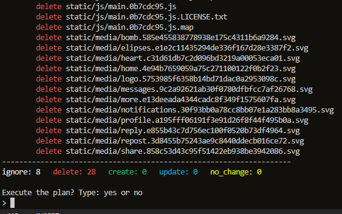
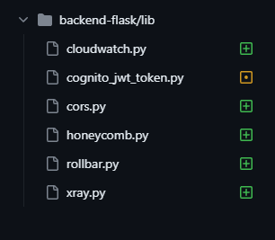
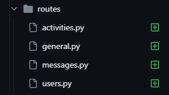
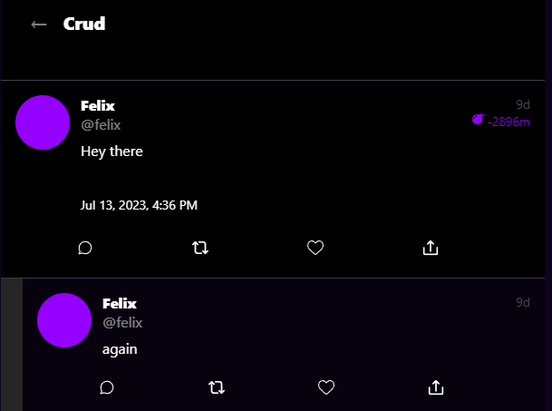
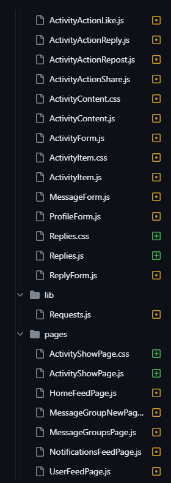
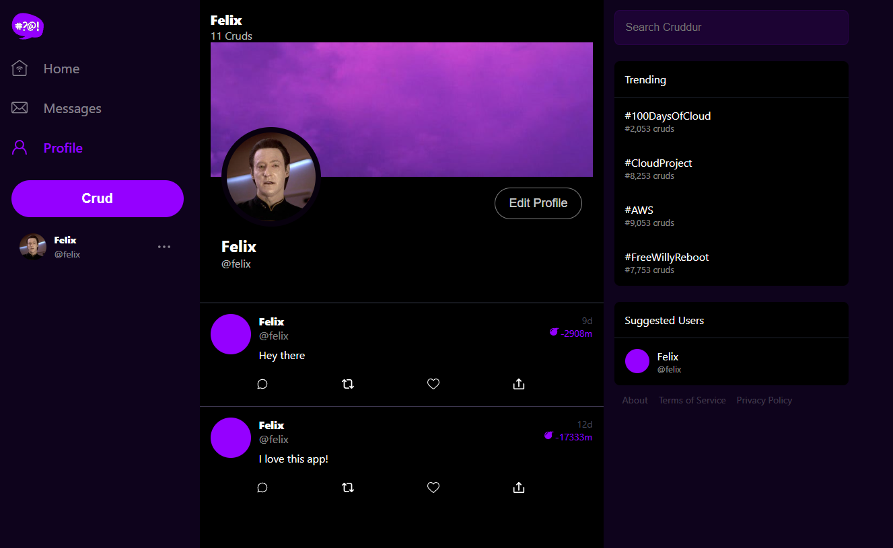
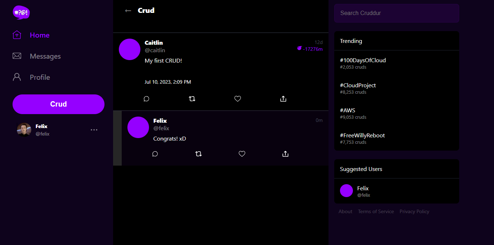

# Week X - Cleanup

## Homework 
- [x] Sync tool for static website hosting
    - [Sync Script](./../bin/frontend/sync)
    - Cloud Formation:
        - [CFN Script](./../bin/cfn/sync)
        - [template.yaml](./../aws/cfn/sync/template.yaml)
        - [config.toml](./../aws/cfn/sync/config.yaml)

    -   

- [x] Reconnect DB and Postgre Confirmation Lamba

- [x] Fix CORS to use domain name for web-app
    - Fixed domain in frontend cfn file:
    - [config.toml](./../aws/cfn/service/config.toml)

- [x] Ensure CI/CD pipeline works and create activity works
    - Fixed repo in pipeline cfn file:
    - [config.toml](./../aws/cfn/cicd/config.toml)
    - Updated HTML & CSS files for activity works

- [x] Refactor to use JWT Decorator in Flask App
    - [cognito_jwt_token.py](./../backend-flask/lib/cognito_jwt_token.py)

- [x] Refactor App.py
    - 

- [x] Refactor Flask Routes
    - 

- [x] Implement Replies for Posts
    - 

- [x] Improved Error Handling for the app
    - Added and implemented:
        1. [FormErrors.js](./../frontend-react-js/src/components/FormErrors.js)
        2. [FormErrors.css](./../frontend-react-js/src/components/FormErrors.css) 
        3. [FormErrorItem.js](./../frontend-react-js/src/components/FormErrorItem.js)

- [x] Activities Show Page
    - Various changes to front and backend files
        - [show.sql](./../backend-flask/db/sql/activities/show.sql)
        - [show_activity.py)](./../backend-flask/services/show_activity.py)
    -  

- [x] More General Cleanup Part 1 and Part 2
    - Updated seed query
    - Updated activity feed, wip
    - Fixed Time formatting
    - More work done on ActivityShow Item & Page
    - Fixing Frontend Errors
    - Add ddb metadata
    - Add cfn machine user template
    - Fix message group page frontend code
    - Fix rollbar
    - Fix Signin/up error handling

## Homework Challenges
- [x] Cleanup navbar
- [x] Fix UI-highlighting of messages page in nav bar
- [x] Activity Feed updates
    - Now the main feed does not show replies
    - Fixed bg color 
- [x] Get profile picture working in prod
- [x] Cleaned up individual CRUD page

-   
-   

